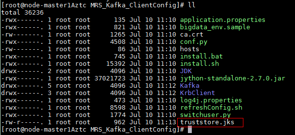

# Security Configuration<a name="EN-US_TOPIC_0221415090"></a>

Flink provides the following security features:

-   All Flink cluster components support authentication.

    Kerberos authentication is supported between internal components and external components of the Flink cluster.

-   Flink cluster components support SSL encrypted transmission.
-   SSL encrypted transmission is supported between internal components of the Flink cluster, for example, between the Flink client and JobManager, JobManager and TaskManager, and TaskManagers.
-   Flink web security hardening
    -   Whitelist filtering. The Flink web can only be accessed through a YARN proxy.
    -   Security header enhancement.

-   In Flink clusters, a listening port range of each component can be configured.
-   In HA mode, ACL is supported.

## Interconnecting with Kafka<a name="section1211073013347"></a>

Flink sample project data is stored in Kafka. Data is sent to and received from Kafka \(user with Kafka permission required\).

1.  Ensure that a cluster containing HDFS, YARN, Flink, and Kafka has been successfully installed.
2.  Create a topic.
    -   Run a Linux command line to create a topic. Before running a command, run the  **kinit**  command, for example,  **kinit flinkuser**, to authenticate the human-machine account.

        > **NOTE:**   
        >**flinkuser**  is created by yourself and has permission to create Kafka topics.   

        The following provides the format of the command for creating a topic.  **\{zkQuorum\}**  indicates ZooKeeper cluster information in  **IP:port**  format.  **\{Topic\}**  indicates the topic name.

        **_bin/kafka-topics.sh --create --zookeeper \{zkQuorum\}/kafka --replication-factor 1 --partitions 5 --topic \{Topic\}_**

        The following uses data of topic1 as an example:

        ```
        /opt/client/Kafka/kafka/bin/kafka-topics.sh --create --zookeeper 10.96.101.32:2181,10.96.101.251:24002,10.96.101.177:24002,10.91.8.160:24002/kafka --replication-factor 1 --partitions 5 --topic topic1
        ```

    -   Configuring the permission of topics on the server

        On MRS Manager. Choose  **Services**  \>  **Kafka**  \>  **Service Configuration**, set  **Type**  to  **All**, and change the value of the Broker parameter  **allow.everyone.if.no.acl.found**  of Kafka to  **true**.

3.  Perform security authentication.

    There are three security authentication modes: Kerberos, SSL, and Kerberos+SSL. You can choose any one of them to perform authentication.

    -   Configuration of Kerberos authentication
        -   Client configuration

            In the Flink configuration file  **flink-conf.yaml**, add configurations about Kerberos authentication. For example, add  **KafkaClient**  in  **contexts**  as follows:

            ```
            security.kerberos.login.keytab: /home/demo/flink/release/keytab/flinkuser.keytab
            security.kerberos.login.principal: flinkuser
            security.kerberos.login.contexts: Client,KafkaClient
            security.kerberos.login.use-ticket-cache: false
            ```

        -   Running parameters

            The following is an example of running parameters about the  **SASL\_PLAINTEXT**  protocol:

            ```
            --topic topic1 --bootstrap.servers 10.96.101.32:21007 --security.protocol SASL_PLAINTEXT  --sasl.kerberos.service.name kafka //10.96.101.32:21007 indicates the IP:port of the Kafka server.
            ```

    -   **SSL encryption configuration**
        -   Server configuration

            On MRS Manager, choose  **Services**  \>  **Kafka**  \>  **Service Configuration**, and set  **Type**  to  **All**. Search for  **ssl.mode.enable**  and set it to  **true**.

        -   Client configuration

            1.  On MRS Manager and choose  **Services**. Click  **Download Client**  to download the client package to a local computer.
            2.  Use the  **ca.crt**  certificate file in the client root directory to generate the  **truststore**  file for the client.

                Run the following command:

                ```
                keytool -noprompt -import -alias myservercert -file ca.crt -keystore truststore.jks 
                ```

                The command execution result is displayed as follows:

                

            3.  Running parameters

            The value of  **ssl.truststore.password**  must be the same as the password you enter when creating  **truststore**. Run the following command to run parameters.

            ```
            --topic topic1 --bootstrap.servers 10.96.101.32:21007 --security.protocol SSL --ssl.truststore.location /home/zgd/software/FusionInsight_Kafka_ClientConfig/truststore.jks --ssl.truststore.password <xxxx>
            ```

    -   Configuration of the Kerberos+SSL mode

        After completing preceding configurations about clients and servers of Kerberos and SSL, modify the port numbers and protocol types in running parameters to enable the Kerberos+SSL mode.

        ```
        --topic topic1 --bootstrap.servers 10.96.101.32:21007 --security.protocol SASL_SSL  --sasl.kerberos.service.name kafka --ssl.truststore.location /home/zgd/software/FusionInsight_Kafka_ClientConfig/truststore.jks --ssl.truststore.password {password}
        ```


