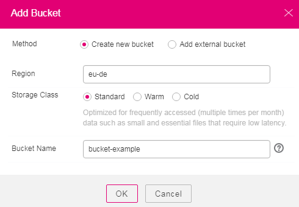

# Adding a Bucket

Buckets are containers that store objects in OBS. Before you store data in OBS, you need to create buckets.

> **NOTE:**   
>On OBS Console, an account can have 100 buckets.  

## Procedure

1.  Log in to OBS Browser.
2.  Click  **Add Bucket**  on the upper left of the page. The  **Add Bucket**  dialog box is displayed.
3.  Set the bucket parameters, as listed in  [Table 1](#tcbb89d695149467789cfdd635af1df0c).

    **Figure  1**  Adding a bucket  
    

    **Table  1**  Creating a Bucket

    
    <table><thead align="left"><tr id="r68a17455096b4296954bbe548e043709"><th class="cellrowborder" valign="top" width="24.43%" id="mcps1.2.3.1.1">
Parameter

    </th>
    <th class="cellrowborder" valign="top" width="75.57000000000001%" id="mcps1.2.3.1.2">
Description

    </th>
    </tr>
    </thead>
    <tbody><tr id="row11330107171416"><td class="cellrowborder" valign="top" width="24.43%" headers="mcps1.2.3.1.1 ">
Method

    </td>
    <td class="cellrowborder" valign="top" width="75.57000000000001%" headers="mcps1.2.3.1.2 ">
Select <strong id="b2063314911316">Create new bucket</strong>.

    </td>
    </tr>
    <tr id="r2249a188eb05438b9917d04f844cad9c"><td class="cellrowborder" valign="top" width="24.43%" headers="mcps1.2.3.1.1 ">
Region

    </td>
    <td class="cellrowborder" valign="top" width="75.57000000000001%" headers="mcps1.2.3.1.2 ">
Region where the bucket to be created is located.

    </td>
    </tr>
    <tr id="rbe52c4e262b746eeb342333853dd9b8b"><td class="cellrowborder" valign="top" width="24.43%" headers="mcps1.2.3.1.1 ">
Storage Class

    </td>
    <td class="cellrowborder" valign="top" width="75.57000000000001%" headers="mcps1.2.3.1.2 ">
OBS offers three storage classes: standard, warm, and cold.

    <ul id="ul37204198202142"><li>Standard storage class: applies to storing frequently accessed (multiple times per month) hot or small files that require quick response.</li></ul>
    <ul id="uef63531703f3494dad84f6a2666529f1"><li>Warm storage class: applies to storing semi-frequently accessed (less than 12 times a year) data requiring quick response.</li><li>Cold storage class: applies to archiving rarely-accessed (once a year) data without high requirements on response speed.</li></ul>
    </td>
    </tr>
    <tr id="rbb06d7afa582475da604f2ba63295b8f"><td class="cellrowborder" valign="top" width="24.43%" headers="mcps1.2.3.1.1 ">
Bucket Name

    </td>
    <td class="cellrowborder" valign="top" width="75.57000000000001%" headers="mcps1.2.3.1.2 ">
Name the bucket according to the globally applied DNS naming regulation as follows:

    <ul id="ul28645947"><li>The name must be globally unique in OBS.</li><li>The name must contain 3 to 63 characters. Only lowercase letters, digits, hyphens (-), and periods (.) are allowed.</li><li>The name cannot start or end with a period (.) or hyphen (-), and cannot contain two consecutive periods (.) or contain a period (.) and a hyphen (-) adjacent to each other.</li><li>The name cannot be an IP address.</li><li>If the name contains any period (.), the security certificate verification may be triggered when you access the bucket or objects in the bucket.</li></ul>
    </td>
    </tr>
    </tbody>
    </table>

    > **NOTE:**   
    >-   When a URL is used to access a bucket, the bucket name will become a part of the URL. According to the DNS rule, URLs do not support uppercase letters and cannot be used to access a bucket whose name contains uppercase letters. Therefore, a bucket name can contain only lowercase letters, digits, hyphens \(-\), and periods \(.\) For example, if you attempt to access bucket  **MyBucket**  using the URL, bucket  **mybucket**  will be accessed instead, causing an access error.  
    >-   DNS naming can standardize the bucket naming globally, facilitating the resolution when accessing a bucket. Users can benefit from new functions and optimized features, and static website hosting is then applicable to buckets.  
    >-   Once you create a bucket, you cannot change the name of it. Make sure that the bucket name you set is appropriate.  

4.  Click  **OK**.
5.  In the displayed dialog box, click  **Close**  to close the dialog box.

## Region Information Configuration

The  **Region**  information can be configured on OBS Browser. The following details the configuration procedure:

1.  Open file  **region**  in folder  **OBS Browser**  in the decompression path of OBS Browser.
2.  Change the value of parameter  **options**  in file  **region**.

    Enter the region information to be added to the end of parameter  **options**  in the following format:

    _\{"key":"Region alias","value":"Region"\}_

    The newly added information must be in the JSON format. The following describes the parameters.

    -   **key**: indicates a user-defined region alias. Its value is in the  **Region**  drop-down list in the  **Add Bucket**  dialog box. For a convenient view, you are advised to enter not more than 25 characters.
    -   **value**  indicates region. Enter the value based on regions supported by OBS.

        Each time when a  **Region**  is added, a group of values will be added to  **options**, that is,  **\{"key":"_Region alias_","value":"_Region_"\}**. Groups of values are separated by commas \(,\). The following provides two configuration examples of newly added  **region01**  and  **region02**. Keep the values of other parameters in file  **region**  unchanged.

        _"options":\[\{"key":"test\_region01","value":"region01"\},\{"key":"test\_region02","value":"region02"\}\]_

3.  After file  **region**  is successfully modified, restart OBS Browser so that the configurations can take effect.

## Follow-up Procedure

You can specify its storage class when creating a bucket or change its storage class after bucket creation. The procedure is as follows:

1.  Log in to OBS Browser.
2.  Select a bucket from the bucket list and click    on the right. The  **Change Storage Class**  dialog box is displayed.
3.  Select the desired storage class and click  **OK**.

    > **NOTE:**   
    >-   Changing the storage class of a bucket does not change the storage class of existing objects in the bucket.  
    >-   When uploading an object, you can select a storage class for the object, which is the same as the bucket storage class by default. If the bucket storage class changes, the default object storage class changes accordingly.  

4.  In the displayed dialog box, click  **Close**  to close the dialog box.

