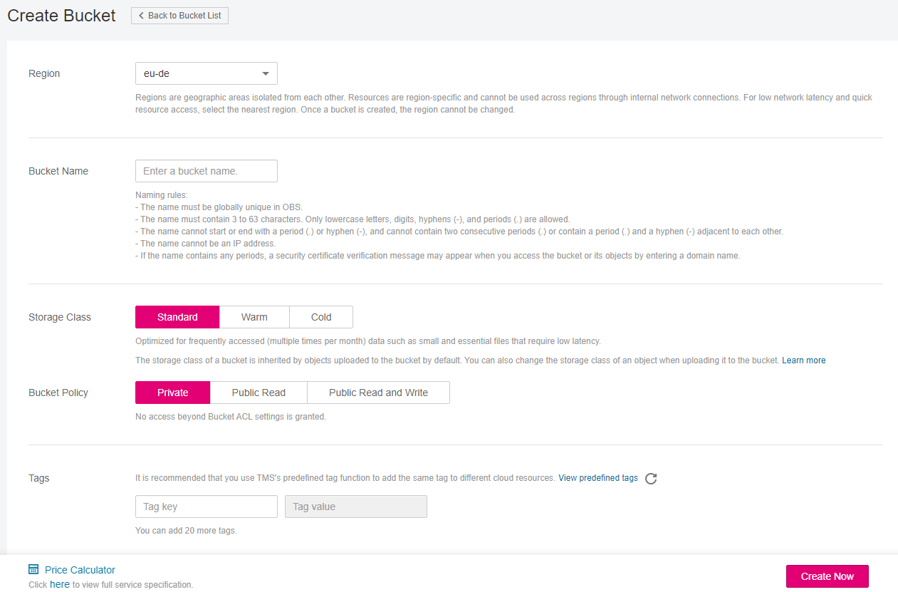
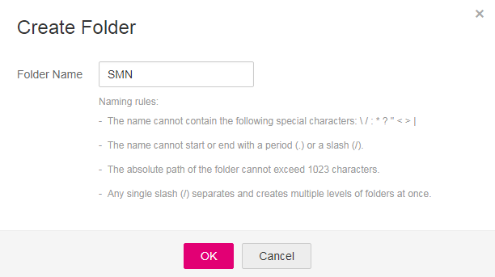
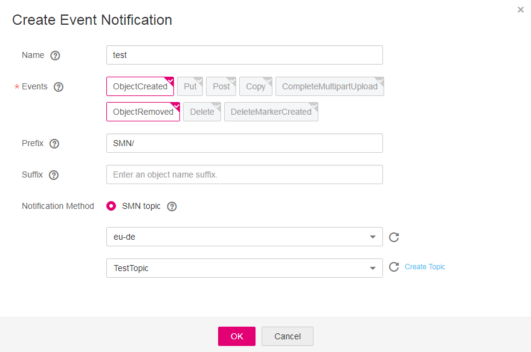

# Application Example: Configuring SMN-Enabled Event Notification

## Background Information

An enterprise has a large number of files to archive but it does not want to cost much on storage resources. Therefore, the enterprise subscribes to OBS for storing the files and expects that every operation performed on OBS can trigger an event notification, which is sent to an employee of the company by email.

## Procedure

1.  Log in to OBS Console as an enterprise user.
2.  Create a bucket.

    Click  **Create Bucket**  on the upper right corner of the page. For details, see  [Figure 1](#fig164117487446). Select  **Region**, select  **Storage Class**, enter the bucket name, and click  **Create Now**.

    **Figure  1**  Creating a bucket  
    

3.  Create a folder.

    Click the bucket created in  [Step 2](#li29947515)  to go to the  **Overview**  page. Choose  **Objects**  \>  **Create Folder**, enter the folder name, and click  **OK**. For details, see  [Figure 2](#fig28070790193136). In the following example,  **SMN**  is the folder name.

    **Figure  2**  Creating a folder  
    

4.  On the top navigation menu, click  **Service List**  \>  **Simple Message Notification**  to go to the SMN console and create an SMN topic. In the following example,  **TestTopic**  is the SMN topic and the notifications are sent by email.

    Use SMN to create a notification topic for OBS as follows:

    1.  Create an SMN topic.
    2.  Add subscription.
    3.  Modify the topic policy. Select  **OBS**  under  **Services that can publish messages**  on the  **Modify Topic Policy**  page.

    For details, see  [Table 1](configuring-smn-enabled-event-notification.md#aobs_console_0039_mmccppss_table01).

5.  On the top navigation menu, click  **Service List**  and choose  **Object Storage Service**  to return to OBS Console.
6.  Configure an event notification rule.
    1.  In the bucket list, click the bucket that you have created in  [2](#li29947515).
    2.  In the navigation pane on the left, choose  **Basic Configurations**  \>  **Event Notification**. The  **Event Notification**  page is displayed.
    3.  Click  **Create**. The  **Create Event Notification**  dialog box is displayed.
    4.  Configure the parameters. See  [Figure 3](#fig377201314360)  for details. For an enterprise account, the specified user in the account will be notified about all specified operations on the  **SMN**  folder in the  **testbucket**  bucket. For details about parameters, see  [Table 1](configuring-smn-enabled-event-notification.md#aobs_console_0039_mmccppss_table01).

        > **NOTE:** 
        >-   A folder path ends with a slash \(/\). Therefore, if you want to configure the event notification for operations on folders and you need to filter folders by suffix, the suffix must also end with a slash \(/\).
        >-   If neither the  **Prefix**  nor the  **Suffix**  is configured, the event notification rule applies to all objects in the bucket.

        **Figure  3**  Adding an event notification rule  
        

## Verification

1.  Log in to OBS Console as an enterprise user.
2.  Upload the  **test.txt**  file to the folder created in  [Step 3](#li44157757145057).

    After the file is uploaded, an employee receives an email similar to the one shown in  [Figure 4](#fig1183879515218). Keyword  **ObjectCreated:Post**  in the email indicates that the object is successfully uploaded.

    **Figure  4**  Email details about the object uploading  
    

3.  Delete the  **test.txt**  file uploaded in  [Step 2](#li38214839153354).

    After the file is successfully deleted, an employee will receive an email similar to the one shown in  [Figure 5](#fig36929030152112). Keyword  **ObjectRemoved:Delete**  in the email indicates that the object is successfully deleted.

    **Figure  5**  Email details about the object deleting  
    

