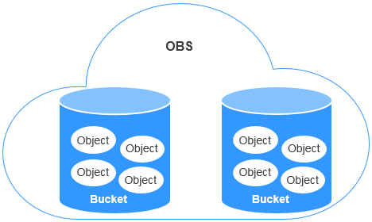

# Buckets

Buckets are containers for storing objects. OBS provides flat storage in the form of buckets and objects. Unlike the conventional multi-layer directory structure of file systems, all objects in a bucket are stored at the same logical layer.

Each bucket has its own attributes, such as access permissions, storage class, and the region. You can specify access permissions, storage class, and regions when creating buckets. You can also configure advanced attributes to meet storage requirements in different scenarios.

OBS provides the following storage classes for buckets: Standard, Warm, and Cold. With diverse storage classes, OBS caters to both storage performance and cost requirements. When creating a bucket, you can set a storage class for the bucket. The storage class of a bucket can be changed as needed.

Each bucket name in OBS is globally unique and cannot be changed after the bucket has been created. The region where a bucket resides cannot be changed once the bucket is created. When a bucket is created, its ACL is generated by default. The ACL is used to grant resource permissions to users. Only authorized users can perform operations such as creating, deleting, viewing, and configuring buckets.

An account can have 100 buckets. However, there is no restriction on the number and total size of objects in a bucket.

OBS adopts the REST architectural style, and is based on HTTP and HTTPS. You can use URLs to locate resources.

[Figure 1](#fig5658599310445)  illustrates the relationship between buckets and objects in OBS.

**Figure  1**  Relationship between objects and buckets  

