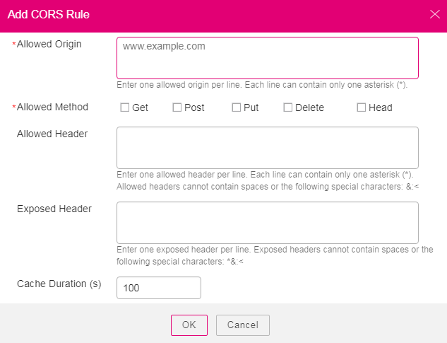

# Configuring CORS

This section describes how to use CORS in HTML5 to implement cross-origin access.

## Procedure

1.  Log in to OBS Browser.
2.  Select the bucket to be configured and click  **More**  \>  **Configure CORS Rule**.
3.  Click  **Add**.

    > **NOTE:**   
    >You can set a maximum of 100 CORS rules for one bucket.  

4.  In the  **Add CORS Rule**  dialog box that is displayed, enter CORS rules.

    **Figure  1**  Adding a CORS rule  
    

    [Table 1](#t810c07199d9d4fb4949e45cc402582a0)  describes parameters in CORS rules.

    **Table  1**  Parameters in CORS rules

    
    <table><thead align="left"><tr id="r282c3ed8eee94e42b62d5849670244ca"><th class="cellrowborder" valign="top" width="32%" id="mcps1.2.3.1.1">
Parameter

    </th>
    <th class="cellrowborder" valign="top" width="68%" id="mcps1.2.3.1.2">
Description

    </th>
    </tr>
    </thead>
    <tbody><tr id="r2ff60e1cc4c04df0bd1b01f6f2bb5196"><td class="cellrowborder" valign="top" width="32%" headers="mcps1.2.3.1.1 ">
Allowed Origin

    </td>
    <td class="cellrowborder" valign="top" width="68%" headers="mcps1.2.3.1.2 ">
Specifies the origin of cross-origin requests. That is, requests from the origin can access the bucket. This parameter is mandatory.

    
Multiple matching rules are allowed. One rule occupies one line, and allows one wildcard character (<strong id="b15430134443519">*</strong>) at most. Example:

    <pre class="screen" id="scbcd7fb5598746eb8312b7ae6cacc05f">http://rds.example.com
    https://*.vbs.example.com</pre>
    </td>
    </tr>
    <tr id="rab81f76db9364bf8ab978a987ee0e07b"><td class="cellrowborder" valign="top" width="32%" headers="mcps1.2.3.1.1 ">
Allowed Method

    </td>
    <td class="cellrowborder" valign="top" width="68%" headers="mcps1.2.3.1.2 ">
Specifies the method of cross-origin requests, that is, the operation type of buckets and objects. This parameter is mandatory. The following methods are included: Get, Post, Put, Delete, and Head.

    </td>
    </tr>
    <tr id="r467a5c6a833f4015bb22f4087de6b74c"><td class="cellrowborder" valign="top" width="32%" headers="mcps1.2.3.1.1 ">
Allowed Header

    </td>
    <td class="cellrowborder" valign="top" width="68%" headers="mcps1.2.3.1.2 ">
Specifies the allowed header of cross-origin requests. This parameter is optional. Only CORS requests matching the allowed header are valid.

    
You can enter multiple allowed headers (one per line) and each line can contain one wildcard character (*) at most. Spaces and special characters including &amp;:&lt; are not allowed.

    </td>
    </tr>
    <tr id="r64d7889221344540a64115505d5e1e72"><td class="cellrowborder" valign="top" width="32%" headers="mcps1.2.3.1.1 ">
Exposed Header

    </td>
    <td class="cellrowborder" valign="top" width="68%" headers="mcps1.2.3.1.2 ">
Specifies the supplemented header in CORS responses, providing additional information for clients. This parameter is optional.

    
You can enter multiple exposed headers (one per line). Spaces and special characters including <strong id="b31335915574">*&amp;:&lt;</strong> are not allowed.

    </td>
    </tr>
    <tr id="r878b4e4c1aa9415ebabb6923463b8153"><td class="cellrowborder" valign="top" width="32%" headers="mcps1.2.3.1.1 ">
Cache Duration (s)

    </td>
    <td class="cellrowborder" valign="top" width="68%" headers="mcps1.2.3.1.2 ">
Mandatory; specifies the duration that your browser can cache CORS responses, expressed in seconds. The default value is 100.

    </td>
    </tr>
    </tbody>
    </table>

5.  Click  **OK**.
6.  Click  **OK**  to save the rules.

    After CORS is successfully configured, only the addresses specified in  **Allowed Origin**  can access a bucket on OBS using the method specified in  **Allowed Method**. For example, you configure CORS parameters of bucket  **testbucket**  as follows:  **Allowed Origin: www.example.com**;  **Allowed Method: GET**;  **Allowed Header**: left blank;  **Exposed Header**: left blank;  **Cache Duration \(s\): 100**

7.  In the displayed dialog box, click  **Close**  to close the dialog box.

