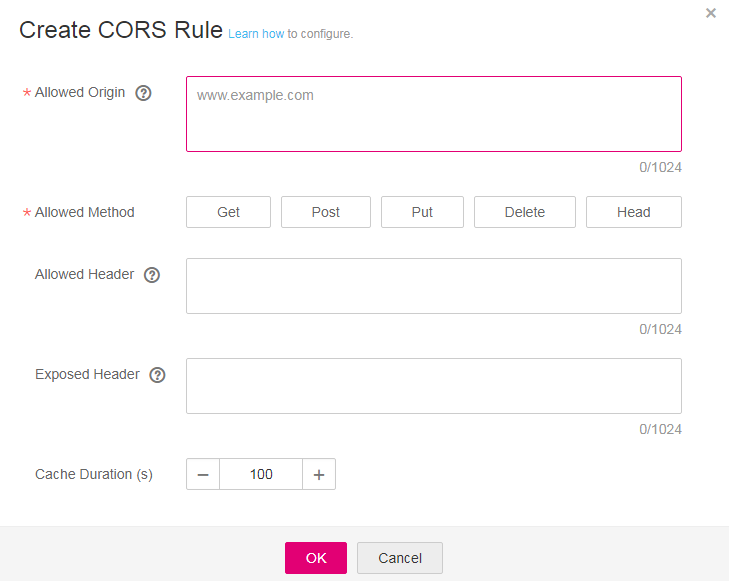

# Configuring CORS

This section describes how to use CORS in HTML5 to implement cross-origin access.

## Prerequisites

Static website hosting has been configured. For details about how to configure static website hosting, see  [Configuring Static Website Hosting](configuring-static-website-hosting.md).

## Procedure

1.  In the bucket list, click the bucket to be operated. The  **Summary**  page of the bucket is displayed.
2.  In the  **Basic Configurations**  area, click the  **CORS Rules**  label. The  **CORS Rules**  page is displayed.

    Alternatively, you can choose  **Basic Configurations**  \>  **CORS Rules**  in the navigation pane on the left.

3.  Click  **Create**. The  **Create CORS Rule**  dialog box is displayed. See  [Figure 1](#fig2425430173411)  for details.

    > **NOTE:**   
    >You can set a maximum of 100 CORS rules for one bucket.  

    **Figure  1**  Creating a CORS rule  
    

4.  In the  **CORS Rule**  dialog box, configure  **Allowed Origin**,  **Allowed Method**,  **Allowed Header**,  **Exposed Header**, and  **Cache Duration \(s\)**.

    **Table  1**  Parameters in CORS rules

    
    <table><thead align="left"><tr id="row14261328"><th class="cellrowborder" valign="top" width="32%" id="mcps1.2.3.1.1">
Parameter

    </th>
    <th class="cellrowborder" valign="top" width="68%" id="mcps1.2.3.1.2">
Description

    </th>
    </tr>
    </thead>
    <tbody><tr id="row47932664"><td class="cellrowborder" valign="top" width="32%" headers="mcps1.2.3.1.1 ">
Allowed Origin

    </td>
    <td class="cellrowborder" valign="top" width="68%" headers="mcps1.2.3.1.2 ">
Mandatory

    
Requests from this origin can access the bucket.

    
Multiple matching rules are allowed. One rule occupies one line, and allows one wildcard character (<strong id="b562579815151012">*</strong>) at most. Example:

    <pre class="screen" id="screen5755676013302">http://rds.example.com
    https://*.vbs.example.com</pre>
    </td>
    </tr>
    <tr id="row18342472"><td class="cellrowborder" valign="top" width="32%" headers="mcps1.2.3.1.1 ">
Allowed Method

    </td>
    <td class="cellrowborder" valign="top" width="68%" headers="mcps1.2.3.1.2 ">
Mandatory

    
Specifies the acceptable operation type of buckets and objects.

    
The methods include Get, Post, Put, Delete, and Head.

    </td>
    </tr>
    <tr id="row34698981"><td class="cellrowborder" valign="top" width="32%" headers="mcps1.2.3.1.1 ">
Allowed Header

    </td>
    <td class="cellrowborder" valign="top" width="68%" headers="mcps1.2.3.1.2 ">
Optional

    
Specifies the allowed header of cross-origin requests.

    
Only CORS requests matching the allowed header are valid.

    
You can enter multiple allowed headers (one per line) and each line can contain one wildcard character (*) at most. Spaces and special characters including <strong id="b648117133820">&amp;:&lt;</strong> are not allowed.

    </td>
    </tr>
    <tr id="row19218446"><td class="cellrowborder" valign="top" width="32%" headers="mcps1.2.3.1.1 ">
Exposed Header

    </td>
    <td class="cellrowborder" valign="top" width="68%" headers="mcps1.2.3.1.2 ">
Optional

    
Specifies the exposed header in CORS responses, providing additional information for clients.

    
You can enter multiple exposed headers (one per line). Spaces and special characters including <strong id="b5125223280">*&amp;:&lt;</strong> are not allowed.

    </td>
    </tr>
    <tr id="row38454973"><td class="cellrowborder" valign="top" width="32%" headers="mcps1.2.3.1.1 ">
Cache Duration (s)

    </td>
    <td class="cellrowborder" valign="top" width="68%" headers="mcps1.2.3.1.2 ">
Mandatory

    
Specifies the duration that your browser can cache CORS responses, expressed in seconds. The default value is <strong id="b1843720126201758">100</strong>.

    </td>
    </tr>
    </tbody>
    </table>

5.  Click  **OK**.

    A message is displayed indicating that CORS configuration of the bucket is successful. The configuration of CORS takes effect within two minutes.

    After CORS is successfully configured, only the addresses specified in  **Allowed Origin**  can access a bucket in OBS using the method specified in  **Allowed Method**. For example, you can configure CORS parameters of bucket  **testbucket**  as follows:

    -   **Allowed Origin**:  **www.example.com**
    -   **Allowed Method**:  **GET**
    -   **Allowed Header**: left blank
    -   **Exposed Header**: left blank
    -   **Cache Duration \(s\)**:  **100**

