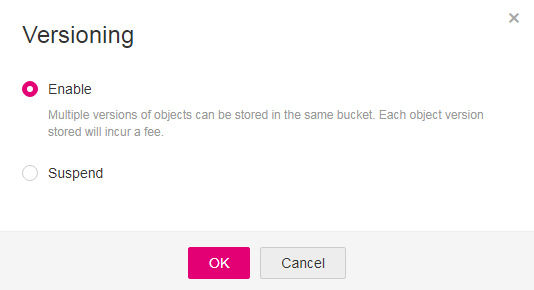

# Configuring Versioning

## Procedure

1.  In the bucket list, click the bucket to be operated. The  **Summary**  page of the bucket is displayed.
2.  Move the cursor over  **Disabled**  or  **Enabled**  next to  **Versioning**  in the  **Basic Information**  area. The  **Edit**  button is displayed next to the versioning status. Click  **Edit**. The dialog box for editing the versioning status is displayed.
3.  Select  **Enable**. For details, see  [Figure 1](#fig17030850192918).

    **Figure  1**  Configuring versioning  
    

4.  Click  **OK**  to enable versioning for objects in the bucket.
5.  Click an object to go to the object details page. On the  **Versions**  tab, view all versions of the object.

## Follow-up Procedure

After versioning is enabled, on the object details page that is displayed, click  **Versions**, and then you can delete and download versions of the object.

1.  In the bucket list, click the bucket to be operated. The  **Summary**  page of the bucket is displayed.
2.  In the navigation pane on the left, click  **Objects**.
3.  In the object list, click the target object. The system displays the object information.
4.  On the  **Versions**  tab, view all versions of the object.
5.  You can perform the following operations on object versions:
    1.  You can download a desired version of the object by clicking  **Download**  on the right of the version.

        > **NOTE:**   
        >If the desired version is in the Cold storage class, it has to be restored before downloading.  

    2.  You can delete a version of the object by clicking  **Delete**  on the right of the version. If you delete the latest version, the most recent version becomes the latest version.

