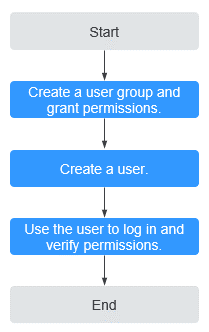

# Creating a User and Granting OBS Permissions

## Process

**Figure  1**  Granting an IAM user the access permissions to OBS  

## Procedure

1.  Log in to the management console using a cloud service account.
2.  On the top navigation menu, choose  **Service List**  \>  **Management & Deployment**  \>  **Identity and Access Management**. The IAM console page is displayed.
3.  Create a user group and grant the OBS permissions to the user group.

    User groups facilitate centralized user management and streamlined permissions management. Users in the same user group have the same permissions. Users created in IAM inherit permissions from the groups to which they belong.

    1.  In the navigation pane on the left, click  **User Groups**. The  **User Groups**  page is displayed.
    2.  Click  **Create User Group**.
    3.  On the  **Create User Group**  page, enter a name for the user group and click  **OK**.

        The user group is displayed in the user group list once the creation completes.

    4.  In the row where the newly created user group resides, click  **Assign Permissions**  in the  **Operation**  column. Then on the  **Group Permissions**  tab page that is displayed, find OBS in the global service region.
    5.  Click  **Attach Policy**  in the  **Operation**  column, select the required policy, and click  **OK**.

        > **NOTE:**   
        >Unfold  **Policy Content**, you can view the details about the policy.  

4.  Create a user.
    1.  In the navigation pane on the left, click  **Users**. The  **Users**  page is displayed.
    2.  Click  **Create User**.
    3.  Set user information and click  **Next**.

        **Table  1**  User parameters

        
        <table><thead align="left"><tr id="row4714144517714"><th class="cellrowborder" valign="top" width="50%" id="mcps1.2.3.1.1">
Parameter

        </th>
        <th class="cellrowborder" valign="top" width="50%" id="mcps1.2.3.1.2">
Description

        </th>
        </tr>
        </thead>
        <tbody><tr id="row157141451376"><td class="cellrowborder" valign="top" width="50%" headers="mcps1.2.3.1.1 ">
Username

        </td>
        <td class="cellrowborder" valign="top" width="50%" headers="mcps1.2.3.1.2 ">
The user name for logging in to the cloud service.

        </td>
        </tr>
        <tr id="row37141245171"><td class="cellrowborder" valign="top" width="50%" headers="mcps1.2.3.1.1 ">
Credential Type

        </td>
        <td class="cellrowborder" valign="top" width="50%" headers="mcps1.2.3.1.2 ">
A credential refers to the identity credential used for user system authentication. In this example, password is selected.<ul id="ul194541357781"><li>Password: Used for accessing cloud services using the console or development tools.</li><li>Access key: Used for logging to the cloud service using development tools. This credential type is more secure, and is recommended if the user does not need to use the console.</li></ul>
        

        </td>
        </tr>
        <tr id="row67141445471"><td class="cellrowborder" valign="top" width="50%" headers="mcps1.2.3.1.1 ">
User Groups

        </td>
        <td class="cellrowborder" valign="top" width="50%" headers="mcps1.2.3.1.2 ">
You can add a user to one or more user groups. Then the user will inherit the permissions granted to these user groups. The default user group <strong id="b181532620463">admin</strong> has the administrator permissions and all of the permissions required to use all cloud resources.

        </td>
        </tr>
        <tr id="row16714184512714"><td class="cellrowborder" valign="top" width="50%" headers="mcps1.2.3.1.1 ">
Description

        </td>
        <td class="cellrowborder" valign="top" width="50%" headers="mcps1.2.3.1.2 ">
(Optional) Brief description about the user.

        </td>
        </tr>
        </tbody>
        </table>

    4.  On the next page, set a password type, an email address, and a mobile number, and click  **OK**.

        Password Types:

        -   **Set at first login**: Select this option if you are not the entity using the user that is being created. The new user can log in to the cloud service through the one-time link provided in the email and set the password upon login.
        -   **Automatically generated**: Select this option if the user that is being created will access the cloud service through development tools. A 10-digit password will be automatically generated.
        -   **Set manually**: Select this option if you are the entity using the user that is being created.

5.  Use the created IAM user to log in to OBS Console and verify the user permissions.

