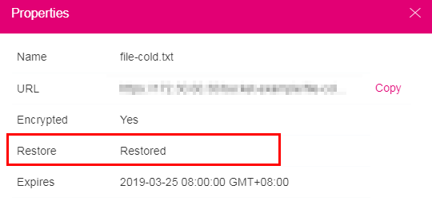

# Restoring a Cold File in OBS

## Background Information

The Cold storage class is applicable to archiving rarely-accessed \(such as once a year\) data. The application scenarios include data archiving and long-term data retention for backup, allowing users to safely store data at a low price. However, it can take up to hours to restore data from the Cold storage class.

If an object in the Cold storage class is being restored, you cannot suspend or delete the restoration task.

You cannot restore an object that is in the  **Restoring**  state.

## Procedure

1.  Log in to OBS Browser.
2.  Click the bucket in which the file that you want to restore resides. The object list is displayed.
3.  Click the restore icon next to the object that you want to restore. Alternatively, you can select an object and click the restore icon on the top of the object list.

    **Table  1**  Parameters for restoring objects

    
    <table><thead align="left"><tr id="obs_03_0320_row20202933164622"><th class="cellrowborder" valign="top" width="23.68%" id="mcps1.2.3.1.1">
Parameter

    </th>
    <th class="cellrowborder" valign="top" width="76.32%" id="mcps1.2.3.1.2">
Description

    </th>
    </tr>
    </thead>
    <tbody><tr id="obs_03_0320_row63287564164622"><td class="cellrowborder" valign="top" width="23.68%" headers="mcps1.2.3.1.1 ">
Validity Period

    </td>
    <td class="cellrowborder" valign="top" width="76.32%" headers="mcps1.2.3.1.2 ">
Time duration when an object remains in the <strong id="obs_03_0320_b105713101419">Restored</strong> state after being restored. The timing starts as the object restoration is completed. The value is an integer ranging from 1 to 30 (days). The default value is 30.

    
For example, you set <strong id="obs_03_0320_b39195835171853">Validity Period</strong> to <strong id="obs_03_0320_b17218197171853">20</strong> when restoring an object. After 20 days starting from the time when the object is successfully restored, the object's status will change from <strong id="obs_03_0320_b34084818146">Restored</strong> to <strong id="obs_03_0320_b193925342113658">Unrestored</strong>.

    </td>
    </tr>
    <tr id="obs_03_0320_row53182611164622"><td class="cellrowborder" valign="top" width="23.68%" headers="mcps1.2.3.1.1 ">
Speed

    </td>
    <td class="cellrowborder" valign="top" width="76.32%" headers="mcps1.2.3.1.2 ">
Restoration speed of an object.

    <ul id="obs_03_0320_ul20730162164622"><li><strong id="obs_03_0320_b1582157145911">Expedited</strong>: Allows you to restore the Cold objects within 1 to 5 minutes.</li><li><strong id="obs_03_0320_b0591717204614">Standard</strong>: Allows you to restore your cold objects within 3 to 5 hours.</li><li><strong id="obs_03_0320_b1759418742113726">Bulk</strong>: Bulk retrievals are the lowest-cost retrieval option of OBS, enabling you to retrieve large amounts, even petabytes, of data in a day at a low cost. Bulk retrievals typically complete within 5 to 12 hours.</li></ul>
    </td>
    </tr>
    </tbody>
    </table>

4.  Click  **OK**.

    Click    and the  **Properties**  dialog box is displayed. For details, see  [Figure 1](#fe014653c9d364bf3999772d96d998638). You can view the restoration status.

    **Figure  1**  Properties of the restored object  
    

    You can download the file only after its status changes to  **Restored**. You can click the  **Refresh**  button in the upper right corner to refresh the restoration tasks and to view the restoration progress. The system also automatically refreshes the restoration tasks every 5 minutes.

    > **NOTE:**   
    >The system checks the file restoration status once a day at UTC 00:00. The expiration time is counted starting from the time when the last check is complete.  

## Follow-up Procedure

Within the validity period of an object, you can repeatedly restore the object. The validity period of the object is counted starting from the time when the latest restoration is completed. By doing so, you can prolong the validity period of an object.

> **NOTE:**   
>If an object is to be restored for a second time, the expiration time set for the second restoration must be later than that set for the first restoration.  

