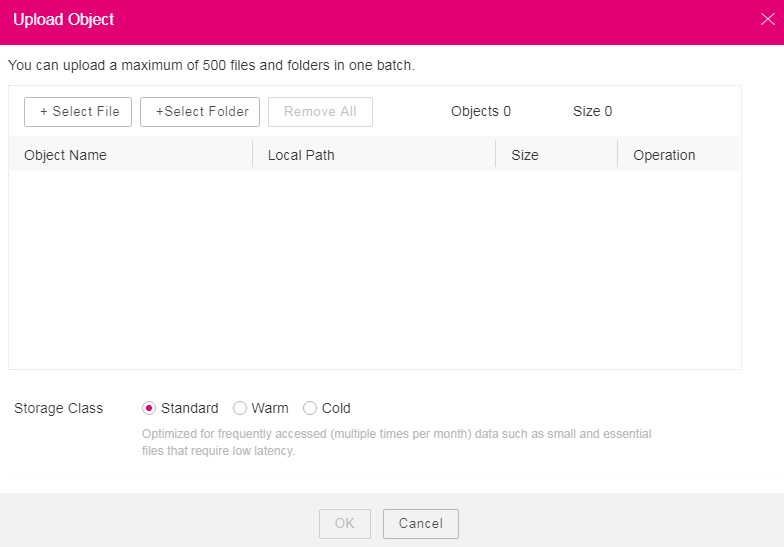

# Uploading a File or Folder

## Background Information

-   Files are uploaded in multiparts on OBS Browser. OBS Browser supports the upload of a single file with the maximum size of 48.8 TB.
-   OBS Browser supports resumable transfer. If the upload task is suspended or fails, restart the task. According to the part information recorded in the task, the successfully uploaded parts will not be uploaded again, and other parts will be requested for uploading.
-   If you want to classify files, you can create folders and upload files to the folders. The procedure is as follows:
    1.  Log in to OBS Browser.
    2.  Click the bucket in which you want to create a folder. Click  **Create Folder**.
    3.  In the dialog box that is displayed, enter a folder name and click  **OK**.
    4.  In the displayed dialog box, click  **OK**  to close the dialog box.

## Procedure

1.  Log in to OBS Browser.
2.  Click the bucket to which the file or folder will be uploaded.
3.  Click  **Upload**. The  **Upload Object**  dialog box is displayed. For details, see  [Figure 1](#fig1511502439).

    You can select either files or folders to upload. For details, see  [4](#li1356818523426)  and  [5](#li018223074620).

    **Figure  1**  Uploading objects  
    

4.  Click  **Select File**. The local file browser dialog box is displayed. Select the file that you want to upload and click  **Open**.

    You can upload a maximum of 500 files or folders at a time.

    > **NOTE:**   
    >If the files to be uploaded to OBS are stored in Microsoft OneDrive, it is recommended that the names of these files contain a maximum of 32 characters.  

5.  Click  **Select Folder**, select a folder, and click  **OK**.
6.  Select a storage class. If no storage class is selected, the object inherits the bucket storage class by default.
7.  Click  **OK**  to upload the file or folder.

