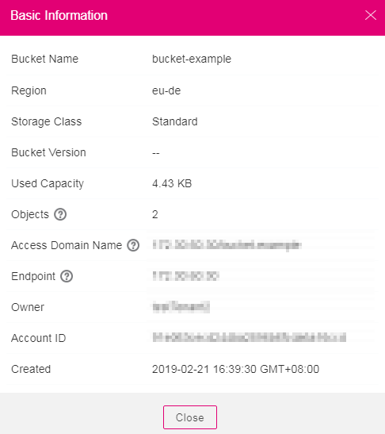

# Viewing Basic Information of a Bucket

This section describes how to view basic information about a bucket, including the owner, capacity, location, and object quantity using OBS Browser.

## Procedure

1.  Log in to OBS Browser.
2.  Click the blank area in the row of the bucket about which you want to query the basic information and click  **Basic Information**.
3.  The  **Basic Information**  window is popped up displaying related information. For details,  [Figure 1](#fig35840242155659).

    **Figure  1**  Basic information about the bucket  
    

    **Table  1**  Parameter description

    
    <table><thead align="left"><tr id="r3491e5e338144b579a4fca838bc0237d"><th class="cellrowborder" valign="top" width="27%" id="mcps1.2.3.1.1">
Parameter

    </th>
    <th class="cellrowborder" valign="top" width="73%" id="mcps1.2.3.1.2">
Description

    </th>
    </tr>
    </thead>
    <tbody><tr id="row164215717380"><td class="cellrowborder" valign="top" width="27%" headers="mcps1.2.3.1.1 ">
Bucket Name

    </td>
    <td class="cellrowborder" valign="top" width="73%" headers="mcps1.2.3.1.2 ">
Name of the bucket.

    </td>
    </tr>
    <tr id="ra2be5def84e74e0bb76977526c9451d3"><td class="cellrowborder" valign="top" width="27%" headers="mcps1.2.3.1.1 ">
Region

    </td>
    <td class="cellrowborder" valign="top" width="73%" headers="mcps1.2.3.1.2 ">
Region where the bucket is stored.

    </td>
    </tr>
    <tr id="rb7e5fba4613d4c7f898374ffb25c728e"><td class="cellrowborder" valign="top" width="27%" headers="mcps1.2.3.1.1 ">
Storage Class

    </td>
    <td class="cellrowborder" valign="top" width="73%" headers="mcps1.2.3.1.2 ">
Indicates the storage class of the bucket, which can be <strong id="b136826264513">Standard</strong>, <strong id="b1868592124514">Warm</strong>, or <strong id="b668720217453">Cold</strong>.

    </td>
    </tr>
    <tr id="row12557174145610"><td class="cellrowborder" valign="top" width="27%" headers="mcps1.2.3.1.1 ">
Bucket Version

    </td>
    <td class="cellrowborder" valign="top" width="73%" headers="mcps1.2.3.1.2 ">
Version ID of a bucket.

    </td>
    </tr>
    <tr id="r261a91b4f5e646b981a4b7f7a36495fb"><td class="cellrowborder" valign="top" width="27%" headers="mcps1.2.3.1.1 ">
Used Capacity

    </td>
    <td class="cellrowborder" valign="top" width="73%" headers="mcps1.2.3.1.2 ">
Total capacity used by objects in the bucket.

    </td>
    </tr>
    <tr id="r85dcfe96a3bc490c842642438490d9e7"><td class="cellrowborder" valign="top" width="27%" headers="mcps1.2.3.1.1 ">
Objects

    </td>
    <td class="cellrowborder" valign="top" width="73%" headers="mcps1.2.3.1.2 ">
The number of objects is the sum of folders and files (including the latest versions and historical versions).

    </td>
    </tr>
    <tr id="row026413344712"><td class="cellrowborder" valign="top" width="27%" headers="mcps1.2.3.1.1 ">
Access Domain Name

    </td>
    <td class="cellrowborder" valign="top" width="73%" headers="mcps1.2.3.1.2 ">
Indicates the access domain name of the bucket, which is in the format of <em id="i105101642144512">Bucket name</em>.<em id="i145127428455">Domain name</em>.

    </td>
    </tr>
    <tr id="row6678195187"><td class="cellrowborder" valign="top" width="27%" headers="mcps1.2.3.1.1 ">
Endpoint

    </td>
    <td class="cellrowborder" valign="top" width="73%" headers="mcps1.2.3.1.2 ">
Indicates the domain name of the region where the bucket resides. OBS provides an endpoint for each region, facilitating users to access resources in each region.

    </td>
    </tr>
    <tr id="row16321236163718"><td class="cellrowborder" valign="top" width="27%" headers="mcps1.2.3.1.1 ">
Owner

    </td>
    <td class="cellrowborder" valign="top" width="73%" headers="mcps1.2.3.1.2 ">
Bucket owner is the account that creates the bucket

    </td>
    </tr>
    <tr id="r3da122b4f2c9404da7fbb03a0949d5a0"><td class="cellrowborder" valign="top" width="27%" headers="mcps1.2.3.1.1 ">
Account ID

    </td>
    <td class="cellrowborder" valign="top" width="73%" headers="mcps1.2.3.1.2 ">
Unique identity of the bucket owner. It is the same as <strong id="b415923912717">Domain ID</strong> on the <strong id="b171595391774">My Credential</strong> page.

    </td>
    </tr>
    <tr id="r66ae4a56bee74c9697633ab781ed602d"><td class="cellrowborder" valign="top" width="27%" headers="mcps1.2.3.1.1 ">
Created

    </td>
    <td class="cellrowborder" valign="top" width="73%" headers="mcps1.2.3.1.2 ">
Time when the creation of a bucket is completed.

    </td>
    </tr>
    </tbody>
    </table>

    > **NOTE:**   
    >The statistics of  **Used Capacity**  and  **Objects**  are not real-time data, which are usually updated 15 minutes in delay.  

