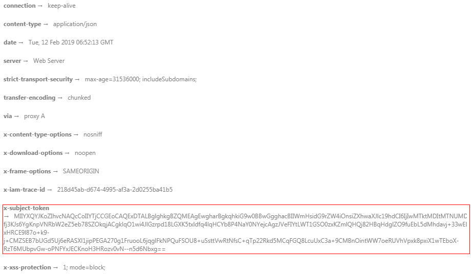

# Response<a name="rds_03_0006"></a>

## Status Code<a name="section968114282311"></a>

After sending a request, you will receive a response, including the status code, response header, and response body.

A status code is a group of digits ranging from 1xx to 5xx. It indicates the status of a response. For more information, see  [Status Codes](status-codes.md).

For example, if status code  **201**  is returned for calling the API used to  [obtain a user token](https://docs.otc.t-systems.com/en-us/api/iam/en-us_topic_0057845583.html), the request is successful.

## Response Header<a name="en-us_topic_0113746487_section61333484715"></a>

Similar to a request, a response also has a header, for example,  **Content-Type**.

[Figure 1](#fig4865141011511)  shows the response header for the API used to  [obtain a user token](https://docs.otc.t-systems.com/en-us/api/iam/en-us_topic_0057845583.html). The  **x-subject-token**  header field is the desired user token. This token can then be used to authenticate the calling of other APIs.

**Figure  1**  Header fields of the response to the request for obtaining a user token<a name="fig4865141011511"></a>  


## \(Optional\) Response Body<a name="en-us_topic_0113746487_section2045571671419"></a>

This part is optional. The body of a response is often returned in structured format as specified in the  **Content-Type**  header field. The response body transfers content except the response header.

The following is part of the response body for the API used to  [obtain a user token](https://docs.otc.t-systems.com/en-us/api/iam/en-us_topic_0057845583.html).

```
{
    "token": {
        "expires_at": "2019-02-13T06:52:13.855000Z",
        "methods": [
            "password"
        ],
        "catalog": [
            {
                "endpoints": [
                    {
                        "region_id": "az-01",
......
```

If an error occurs during API calling, an error code and a message will be displayed. The following shows an error response body.

```
{
	"error_code": "AS.0001",
	"error_msg": "The format of message is error"
}
```

In the response body,  **error\_code**  is an error code, and  **error\_msg**  provides information about the error.

