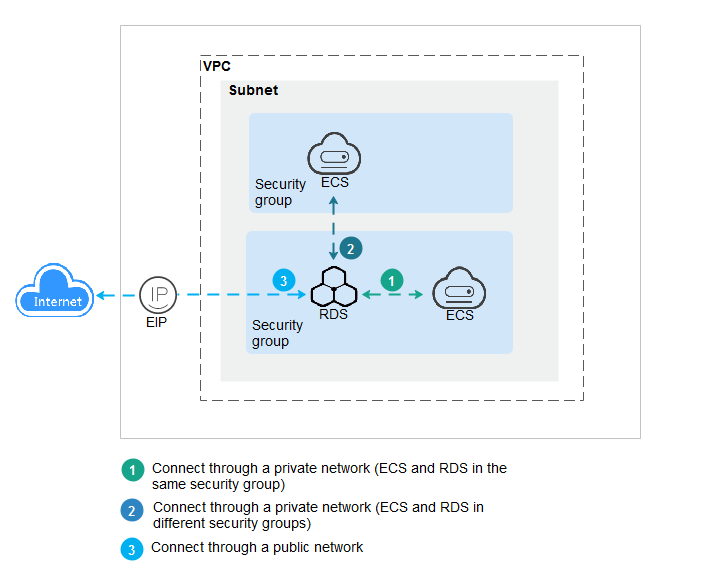

# Connecting to a DB Instance

An RDS DB instance can be connected through a private network or a public network.

**Table  1**  RDS connection methods

<table><thead align="left"><tr id="rds_02_0060_row248916316436"><th class="cellrowborder" valign="top" width="22.772277227722775%" id="mcps1.2.5.1.1">
<strong id="rds_02_0060_b2661739175512">Connect Through</strong>

</th>
<th class="cellrowborder" valign="top" width="22.772277227722775%" id="mcps1.2.5.1.2">
<strong id="rds_02_0060_b1793194110559">IP Address</strong>

</th>
<th class="cellrowborder" valign="top" width="29.7029702970297%" id="mcps1.2.5.1.3">
<strong id="rds_02_0060_b9504164312554">Scenarios</strong>

</th>
<th class="cellrowborder" valign="top" width="24.752475247524753%" id="mcps1.2.5.1.4">
<strong id="rds_02_0060_a97668864bf874d57b57a1c1492147784">Description</strong>

</th>
</tr>
</thead>
<tbody><tr id="rds_02_0060_row248973134318"><td class="cellrowborder" valign="top" width="22.772277227722775%" headers="mcps1.2.5.1.1 ">
Private network

</td>
<td class="cellrowborder" valign="top" width="22.772277227722775%" headers="mcps1.2.5.1.2 ">
Floating IP

</td>
<td class="cellrowborder" valign="top" width="29.7029702970297%" headers="mcps1.2.5.1.3 ">
RDS provides a floating IP address by default.

When your applications are deployed on an ECS that is in the same region and VPC as RDS, you are advised to use a floating IP address to connect to RDS DB instance through the ECS.

</td>
<td class="cellrowborder" valign="top" width="24.752475247524753%" headers="mcps1.2.5.1.4 "><ul id="rds_02_0060_ul589414895513"><li>Secure and excellent performance</li><li>Recommended</li></ul>
</td>
</tr>
<tr id="rds_02_0060_row871255113459"><td class="cellrowborder" valign="top" width="22.772277227722775%" headers="mcps1.2.5.1.1 ">
Public network

</td>
<td class="cellrowborder" valign="top" width="22.772277227722775%" headers="mcps1.2.5.1.2 ">
EIP

</td>
<td class="cellrowborder" valign="top" width="29.7029702970297%" headers="mcps1.2.5.1.3 ">
If you cannot access an RDS DB instance through a floating IP address, bind an EIP to the DB instance and connect the ECS to the DB instance through the EIP.

</td>
<td class="cellrowborder" valign="top" width="24.752475247524753%" headers="mcps1.2.5.1.4 "><ul id="rds_02_0060_ul58856110012"><li>Low security</li><li>To achieve a higher transmission rate and security level, you are advised to migrate your applications to an ECS that is in the same subnet as your RDS DB instance and use a floating IP address to access the DB instance.</li></ul>
</td>
</tr>
</tbody>
</table>

> **NOTE:**   
>-   VPC: indicates the Virtual Private Cloud.  
>-   ECS: indicates the Elastic Cloud Server.  
>-   If the ECS is in the same VPC subnet as the RDS DB instance, you do not need to apply for an EIP.  

[Figure 1](#rds_02_0060_fig6120201385414)  illustrates the connection over a private network or a public network.

**Figure  1**  DB instance connection  

