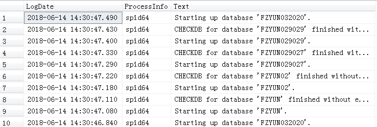

# How Can I Obtain Microsoft SQL Server Error Logs Using Commands?

1.  Log in to the Microsoft SQL Server client as user  **rdsuser**.
2.  Run the following statement to query error logs:

    **EXECUTE master.dbo.rds\_read\_errorlog**_ FileID_,_LogType_,_FilterText,__FilterBeginTime,__FilterEndTime_

    -   _FileID_: indicates the ID of an error log. The value  **0**  indicates the latest logs.
    -   _LogType_: indicates the log type. The value  **1**  indicates error logs and value  **2**  indicates agent logs.
    -   _FilterText_: indicates a keyword, which can be  **NULL**.
    -   _FilterBeginTime_: indicates the start time in queries, which can be  **NULL**.
    -   _FilterEndTime_: indicates the completion time in queries, which can be  **NULL**.

    Example:

    **EXEC master.dbo.rds\_read\_errorlog 0,1,'FZYUN','2018-06-14 14:30',**'2018-06-14 14:31'****

    [Figure 1](#f84f34c123aa54ed78685e291aea78a31)  shows the query results.

    **Figure  1**  Example query results  
    

