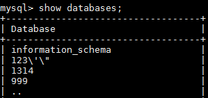

# Restoring Data from MySQL Backup Files

## **Scenarios**

You can download backup files by referring to  [Downloading a Backup File](downloading-a-backup-file.md)  and restore data from them. This section uses CentOS 7.4 64bit and MySQL 5.6 as examples to describe how to restore data.

> **NOTICE:**   
>Backup data cannot be restored to local databases that run the Windows operating system.  

## Prerequisites

When you restore data from backup files to self-built MySQL databases, ensure that the target MySQL version is later than or equal to the original MySQL version.

During data restoration, run the following command to view the restoration process:

**ps -ef | grep mysql**

## **Procedure**

1.  Download the qpress program and upload it to the ECS for installation.

    Download  **qpress-11-linux.x64.tar**  from the  [website](http://www.quicklz.com)  and upload it to the ECS.

    **tar -xvf** _qpress-11-linux-x64.tar_

    **mv** _qpress /usr/bin/_

2.  Download the XtraBackup software and upload it to the ECS for installation.

    > **NOTICE:**   
    >Ensure that the XtraBackup version is 2.4.9 or later. Otherwise, an error will be reported in subsequent steps.  

    Download  **percona-xtrabackup-24-2.4.9-1.el7.x86\_64.rpm**  from the  [website](https://www.percona.com/downloads/Percona-XtraBackup-2.4/LATEST/)  and upload it to the ECS.

    **rpm -ivh** _percona-xtrabackup-24-2.4.9-1.el7.x86\_64.rpm_ **--nodeps --force**

3.  On the ECS, decompress the full backup file that has been downloaded.
    1.  Create a temporary directory  **backupdir**.

        **mkdir** _backupdir_

    2.  Decompress the package.

        **xbstream  -x -p 4 <** _./mysql\_xtrabackup\_ file.qp_ **-C** _./backupdir/_

        **innobackupex --parallel 4 --decompress** _./backupdir_

        **find** _./backupdir/ _ **-name** _'\*.qp'_ **|** _xargs_ **rm -f**

4.  Apply the log.

    **innobackupex --apply-log **_./backupdir_

5.  Back up data.
    1.  Stop MySQL database services.

        **service **_mysql_** stop**

        > **NOTE:**   
        >For MySQL 5.7, run the following command to stop MySQL database services:  
        >**/bin/systemctl stop  mysqld.service**  

    2.  Back up the original database directory.

        **mv**  /var/lib/mysql/data  /var/lib/mysql_/data\_bak_

    3.  Create a new database directory and change the permissions.

        **mkdir **_/var/lib/mysql/data_

        **chown** _mysql:mysql__ /var/lib/mysql/data_

6.  Copy the full backup file and change the directory permissions.

    **innobackupex --defaults-file=/etc/my.cnf --copy-back** _./backupdir_

    **chown -R** _mysql:mysql /var/lib/mysql/data_

7.  Start the database.

    **service**_ mysql_ **start**

    > **NOTE:**   
    >For MySQL 5.7, run the following command to start the database:  
    >**/bin/systemctl start  mysqld.service**  

8.  Run the following commands to log in to the database and view the restoration result:

    **mysql -u root**

    **show databases**

    **Figure  1**  Viewing the restoration result  
    

