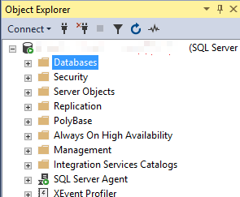
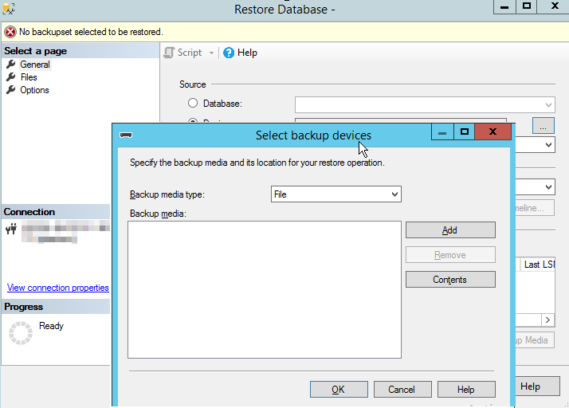

# Restoring Data from SQL Server Backup Files

You can download backup files by referring to section  [Downloading a Backup File](downloading-a-backup-file-105.md)  and restore data from them. You can use SQL Server Management Studio \(SSMS\) to connect to a self-built ECS database or local database to restore data. The following uses SSMS as an example to show how to restore data from a backup file on a local database.

> **NOTE:**   
>-   Before restoring data, ensure that the ECS has been installed with the SQL Server database service running a same or later version than the SQL Server databases.  

## Procedure

1.  Download SSMS and upload it to the ECS for installation.

    Download  **SSMS 18.0 \(GA\)**  from the  [website](https://docs.microsoft.com/en-us/sql/ssms/download-sql-server-management-studio-ssms?view=sql-server-2017)  and upload it to the ECS.

2.  On the ECS, decompress the RDS full backup file that has been downloaded.
3.  Start the SSMS client.
4.  Log in to the local database service through the SSMS client.
5.  In the SSMS client, right-click  **Databases**  and choose  **Restore Database**.

    

6.  In the displayed  **Restore Database**  dialog box, select  **Device**  in the  **Source**  pane. In the displayed  **Select backup devices**  dialog box, specify the backup media and its location and click  **OK**.

    1.  Set  **Backup media type**  to  **File**.
    2.  Click  **Add**  to add the decompressed backup file \(in the .bak format\) and configure required information.

    

