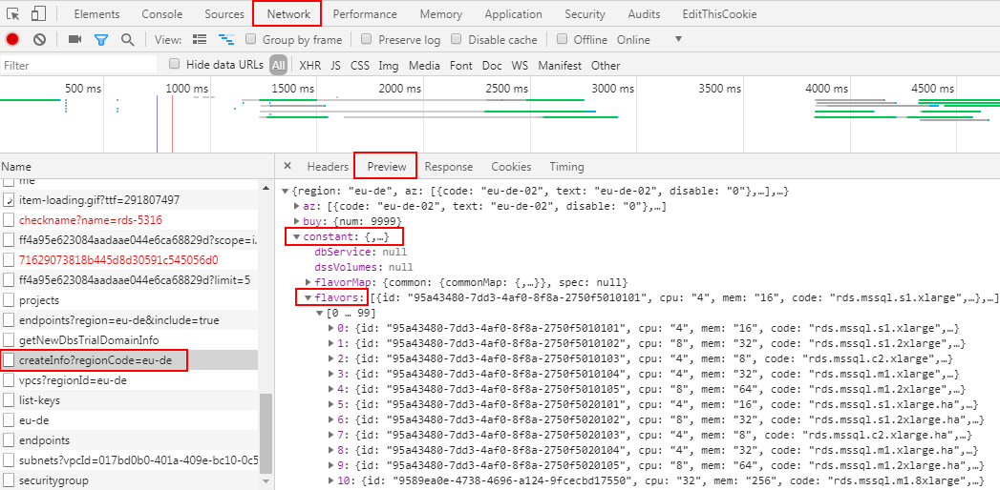

# How to Obtain the flavor Value of Resource OSE::RDS::Instance?

## Method 1: By Using the Console

1.  Log in to the management console.

    Google Chrome is recommended.

2.  Choose  **Database**  \>  **Relational Database Service**.
3.  In the upper right corner of the displayed page, click  **Create DB Instance**.
4.  Press  **F12**  and click  **Network**.
5.  Refresh the page, find  **createInfo?regionCode=eu-de**  in the request list, and click  **Preview**. Choose  **constant**  \>  **flavors**  to obtain the flavor IDs and other information.

    **Figure  1**  Obtaining flavor information  
    

6.  Select the flavor ID based on the selected database type, backup policy, and required memory and CPU.

    Determine the database type and HA policy based on field  **code**  of the flavor. For example, if field  **code**  of the flavor is  **rds.mysql.m1.large.ha**, you can create MySQL primary/standby DB instances.

## Method 2: By Calling the API

1.  Call the IAM API to obtain the token.

    **curl -i -k -X POST **_https://auth.otc-tsi.de:31943/v3/auth/tokens_** -d '\{"auth": \{"identity": \{"methods": \["password"\],"password": \{"user": \{"name": "**_\*\*\*\*\*_**","domain": \{"name": "**_\*\*\*\*_**"\},"password": "**_\*\*\*\*_**"\}\}\},"scope": \{"project": \{"name": "**_eu-de_**"\}\}\}\}' -H "Content-Type: application/json"**

2.  Save the token information.

    Save the token obtained in  [1](#li7547856798)  and import variables.

    The following is an example command:

    **export token=**_MIIF5gY\*\*\*\*\*\*\*cNxyvq4=_

3.  Invoke the RDS API for obtaining the database version.

    URI format:  **GET /rds/\{versionId\}/\{project\_id\}/datastores/\{datastore\_name\}/versions**

    The following is an example command:

    **curl -i -X GET **_https://rds.eu-de.otc.t-systems.com/rds/v1/3160d79af34b45e78fad478a046d7615/datastores/PostgreSQL/versions _**-H 'Content-Type: application/json' -H 'Accept: application/json' -H 'User-Agent: python-heatclient' -k -H "X-Auth-Token: $token" -H 'X-Language: en-us'**

    > **NOTE:**   
    >In the URI,  _datastore\_name_  indicates the type of the database to be created. Currently, the following database types are supported: MySQL, PostgreSQL, and SQLServer. These types are case sensitive.  

4.  Invoke the RDS API for obtaining specifications of all DB instances.

    URI format: GET /rds/\{versionId\}/\{project\_id\}/flavors

    Example command:  **curl -i -k -X GET "**_https://rds.eu-de.otc.t-systems.com_**/rds/v1/**_3160d79af34b45e78fad478a046d7615_**/flavors?dbId=**_c66772dd-bd7a-11e7-a4c9-00ffa8375c2a_**&region=**_eu-de_**" -H 'Content-Type: application/json' -H 'Accept: application/json' -H 'User-Agent: python-heatclient' -H "X-Auth-Token: $token" -H "X-Language: en-us"**

    > **NOTE:**   
    >**dbId**  indicates the ID of the DB engine version ID obtained in  [3](#li164268420109).  

5.  Select the flavor ID based on the selected backup policy and required memory and CPU.

    Determine the database type and HA policy based on field  **specCode**  of the flavor. For example, if field  **specCode**  of the flavor is  **rds.mysql.m1.large.ha**, you can create MySQL primary/standby DB instances.

