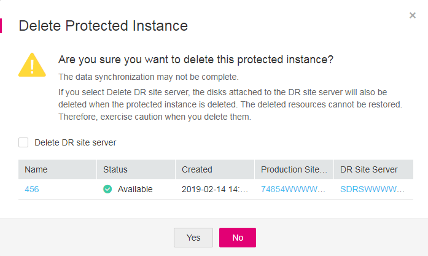

# Deleting a Protected Instance

## Scenarios

If you do not need a protected instance, you can delete it to cancel the protection relationship between the servers and the protection group.

When you delete a protected instance, the production site server in the protected instance will not be deleted, and services at the production site will not be affected.

## **Prerequisites**

The protected instance is in the  **Available**,  **Protecting**,  **Failover complete**,  **Creation failed**,  **Enabling protection failed**,  **Disabling protection failed**,  **Planned failover failed**,  **Failover failed**,  **Deletion failed**,  **Re-enabling protection failed**,  **Modifying specifications failed**,  **Invalid**, or  **Faulty**  state.

## Procedure

1.  Log in to the management console.
2.  Click  **Service List**  and choose  **Storage**  \>  **Storage Disaster Recovery Service**.

    The  **Storage Disaster Recovery Service**  page is displayed.

3.  In the pane of the protection group for which the protected instance is to be deleted, click  **Protected Instances**.

    The operation page for the protection group is displayed.

4.  On the  **Protected Instances**  tab, locate the row containing the protected instance to be deleted, click  **More**  in the  **Operation**  column, and choose  **Delete**  from the drop-down list.

    To delete protected instances in batches, select the target protected instances and click  **Delete**  above the protected instance list.

    The  **Delete Protected Instance**  page is displayed.

    **Figure  1**  Deleting a protected instance  
    

5.  On the  **Delete Protected Instance**  page, select the desired operation.

    > **NOTE:**   
    >-   If you select  **Delete DR site server**, do not perform any other operations on the DR site server or its related resources when the system is deleting the DR site server.  

    -   Delete DR site server
        -   If you do not select this option, the protection relationship between the protected instance and protection group will be canceled, but the DR site server and disks attached to the server will be retained.
        -   If you select this option, the protection relationship between the protected instance and protection group will be canceled, and the DR site server and disks attached to the server will be deleted.

    -   Release the EIP bound to the following DR site server

        This parameter is displayed when you select  **Delete DR site server**.

        -   If you do not select this option, the DR site server will be deleted, but the EIP bound to the server will be retained.
        -   If you select this option, the DR site server will be deleted, and the EIP bound to the server will be released.

6.  Click  **Yes**.

