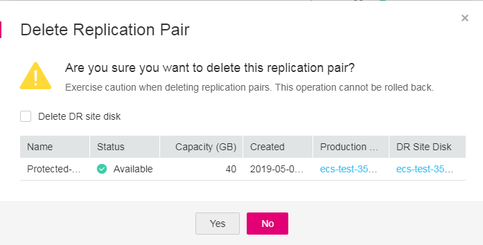

# Deleting a Replication Pair

## Scenarios

If a replication pair is no longer used, you can release the associated virtual resources by deleting the replication pair from the system.

When you delete a replication pair, the production site disk in the replication pair will not be deleted. You can decide whether to delete the DR site disk.

## **Prerequisites**

-   The protection group is in the  **Available**,  **Protecting**,  **Failover complete**,  **Enabling protection failed**,  **Disabling protection failed**,  **Planned failover failed**,  **Failover failed**, Deletion failed, or  **Re-enabling protection failed**  state.
-   The replication pair is in the  **Available**,  **Protecting**,  **Failover complete**,  **Creation failed**,  **Enabling protection failed**,  **Disabling protection failed**,  **Planned failover failed**,  **Failover failed**,  **Deletion failed**,  **Re-enabling protection failed**,  **Attaching failed**,  **Expansion failed**,  **Invalid**, or  **Faulty**  state.
-   The replication pair is not attached to any protected instance. For details about how to detach a replication pair, see  [Detaching a Replication Pair](detaching-a-replication-pair.md).

## Procedure

1.  Log in to the management console.
2.  Click  **Service List**  and choose  **Storage**  \>  **Storage Disaster Recovery Service**.

    The  **Storage Disaster Recovery Service**  page is displayed.

3.  In the pane of the protection group, click  **Replication Pairs**.

    The operation page for the protection group is displayed.

4.  On the  **Replication Pairs**  tab, locate the row containing the replication pair to be deleted and click  **Delete**  in the  **Operation**  column.

    The  **Delete Replication Pair**  dialog box is displayed.

    **Figure  1**  Deleting a replication pair  
    

    > **NOTE:**   
    >When you delete a replication pair, the production site disk will not be deleted.  

5.  Determine the subsequent operation.

    Delete DR Site Disk

    -   If you do not select this option, the replication pair relationship between the production site disk and DR site disk will be canceled, and the DR site disk will be retained.
    -   If you select this option, the replication pair relationship between the production site disk and DR site disk will be canceled, and the DR site disk will be deleted.

6.  Click  **Yes**.

