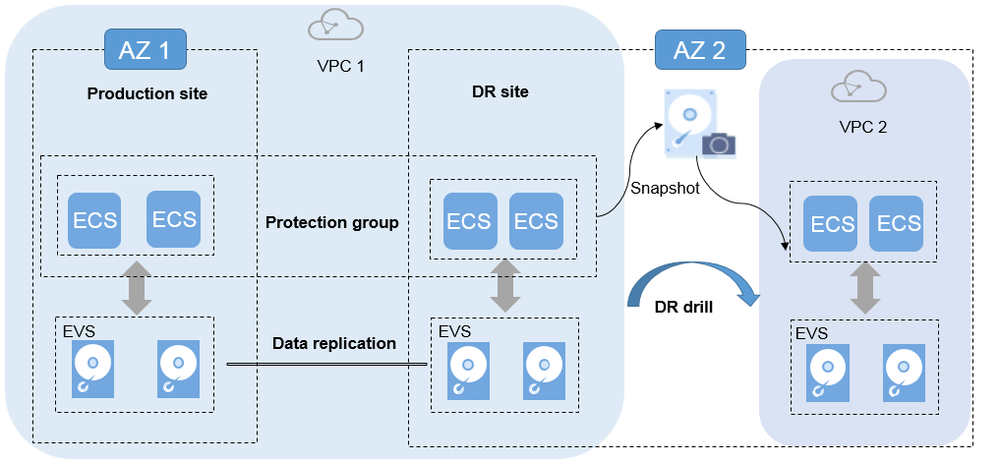

# Performing a DR Drill

## Scenarios

DR drills can be used to simulate fault scenarios, specify the emergency recovery solutions, and verify whether the solutions are applicable and effective. The existing services will not be affected during the DR drill. When a real fault occurs, you can use the solutions to rapidly restore services, enhancing service continuity.

SDRS provides the DR drill function. You can perform DR drills in a drill VPC \(different from the VPC of the DR site\). This function allows you to use the disk snapshots of the DR site servers to create drill servers with the server specifications and disk types same as the DR site servers.

> **NOTE:**   
>After the DR drill server is created, the production site server and DR drill server will independently run at the same time \(data will not be synchronized between these two servers\).  

To ensure that a failover can be properly performed if a disaster happens, you are recommended to perform DR drills regularly to verify that:

-   The production site data and DR site data are consistent at the moment when you create a DR drill.
-   The services at the DR site can run properly after a failover.

    **Figure  1**  Performing a DR drill  
    

## Notes

-   If the DR site server of the protection group is added to Enterprise Project, the created DR drill server will not be automatically added to Enterprise Project. You need to manually add it to Enterprise Project if needed.
-   When you use a created drill VPC to create a drill, the subnet ACL rule of the drill VPC will be different from that of the VPC of the protection group. You need to manually set them to be the same one if needed.
-   When you create a DR drill, if the VPC of the protection group has a customized routing table and subnets configured, the corresponding routing table will not be automatically created for the drill VPC. You need to manually create it if needed.
-   If the DR site server runs Windows and uses the key login mode, ensure that the key pair of the DR site server exists when you create a DR drill. Otherwise, the DR drill server may fail to create, causing the DR drill creation failure.

    > **NOTE:**   
    >If the key pair of the DR site server has been deleted, create a key pair with the same name.  

-   When you create a DR drill, if the DR site server runs Linux and uses the key login mode, the key pair information will not be displayed on the details page of the DR drill server after the DR drill server is created. You can use the key pair of the DR site server to log in to the DR drill server.
-   After you create a DR drill, modifications to the  **Hostname**,  **Name**,  **Agency**,  **ECS Group**,  **Security Group**,  **Tags**, and  **Auto Recovery**  configurations of the DR site server before the drill will not synchronize to the DR drill server. You can log in to the management console and manually add the configuration items to the DR drill server.
-   If the synchronization progress of replication pairs in the protection group is not 100%, the created DR drill server may fail to start. You are advised to perform a DR drill after all replication pairs are synchronized.

## **Prerequisites**

-   The protection group is in the  **Available**,  **Protecting**,  **Failover complete**,  **Enabling protection failed**,  **Disabling protection failed**,  **Planned failover failed**,  **Re-enabling protection failed**, or  **Failover failed**  state.
-   Do not perform a DR drill before the first time data synchronization between the production site server and DR site server completes. Otherwise, the drill server may not start properly.

## Procedure

1.  Log in to the management console. 
2.  Click  **Service List**  and choose  **Storage**  \>  **Storage Disaster Recovery Service**.

    The  **Storage Disaster Recovery Service**  page is displayed.

3.  In the pane of the protection group to which a DR drill is to be added, click  **DR Drills**.

    The operation page for the protection group is displayed.

4.  On the  **DR Drills**  tab, click  **Create DR Drill**.

    The  **Create DR Drill**  dialog box is displayed.

5.  Configure  **Name**  and  **Drill VPC**.

    **Table  1**  Parameter description

    
    <table><thead align="left"><tr id="en-us_topic_0122528555_row18279121110532"><th class="cellrowborder" valign="top" width="33.33333333333333%" id="mcps1.2.4.1.1">
<strong id="en-us_topic_0122528555_b842352706211121">Parameter</strong>

    </th>
    <th class="cellrowborder" valign="top" width="33.33333333333333%" id="mcps1.2.4.1.2">
<strong id="en-us_topic_0122528555_b8423527061662">Description</strong>

    </th>
    <th class="cellrowborder" valign="top" width="33.33333333333333%" id="mcps1.2.4.1.3">
<strong>Example Value</strong>

    </th>
    </tr>
    </thead>
    <tbody><tr id="en-us_topic_0122528555_row1527915119539"><td class="cellrowborder" valign="top" width="33.33333333333333%" headers="mcps1.2.4.1.1 ">
Name

    </td>
    <td class="cellrowborder" valign="top" width="33.33333333333333%" headers="mcps1.2.4.1.2 ">
Specifies the DR drill name.

    </td>
    <td class="cellrowborder" valign="top" width="33.33333333333333%" headers="mcps1.2.4.1.3 ">
DR drill servername

    </td>
    </tr>
    <tr id="en-us_topic_0122528555_row1627921117530"><td class="cellrowborder" valign="top" width="33.33333333333333%" headers="mcps1.2.4.1.1 ">
Drill VPC 

    </td>
    <td class="cellrowborder" valign="top" width="33.33333333333333%" headers="mcps1.2.4.1.2 ">
The VPC is used for a DR drill and cannot be the same as the VPC of the DR site server. Specifies the drill VPC. The value can be <strong id="en-us_topic_0122528555_b4824517172910">Automatically create</strong> or <strong id="en-us_topic_0122528555_b8236221162915">Use existing</strong>.

    <ul id="en-us_topic_0122528555_ul3372115552310"><li><strong id="en-us_topic_0122528555_b5214123211294">Automatically create</strong>: The system automatically creates a drill VPC and subnets for the protection group.</li><li><strong id="en-us_topic_0122528555_b982383817298">Use existing</strong>: The system uses an existing VPC as the drill VPC. If you select to use an existing VPC, the subnet CIDR block of the drill VPC must be consistent with that of the production group VPC.</li></ul>
    
 NOTE: 

The drill VPC cannot be the same as the VPC of the protection group.

    

    </td>
    <td class="cellrowborder" valign="top" width="33.33333333333333%" headers="mcps1.2.4.1.3 ">
vpc-f9f7

    </td>
    </tr>
    </tbody>
    </table>

6.  Click  **OK**.

    After a DR drill is created, you can log in to the DR drill server and check whether services are running properly.

