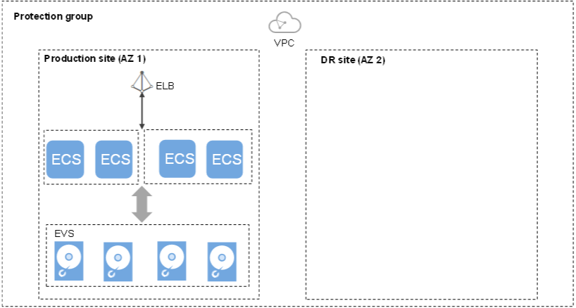
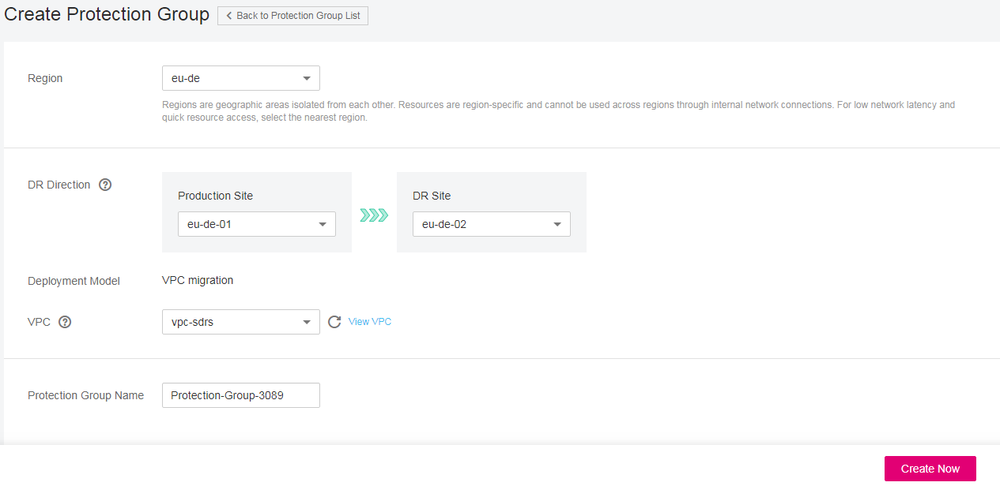

# Step 1: Create a Protection Group

## Scenarios

You can specify two AZs as the source and target AZs, and create a protection group. Then, you can create protected instances and replication pairs in this protection group.

Verify the servers at the production and DR sites before you create a protection group. In this version, only the VPC migration deployment model is supported. Specifically, the servers at the production and DR sites must be in different AZs but in the same VPC. 

**Figure  1**  Creating a protection group  

## Procedure

1.  Log in to the management console.
2.  Click  **Service List**  and choose  **Storage**  \>  **Storage Disaster Recovery Service**.

    The  **Storage Disaster Recovery Service**  page is displayed.

3.  Click  **Create Protection Group**.

    The  **Create Protection Group**  page is displayed.

    **Figure  2**  Creating a protection group  
    

4.  Configure the basic information about the protection group listed in  [Table 1](#table0120161710336). 

    > **NOTE:**   
    >All the parameters in the following table are mandatory.  

    **Table  1**  Parameter description

    
    <table><thead align="left"><tr id="row10120117163319"><th class="cellrowborder" valign="top" width="33.33333333333333%" id="mcps1.2.4.1.1">
<strong id="b842352706211121">Parameter</strong>

    </th>
    <th class="cellrowborder" valign="top" width="33.33333333333333%" id="mcps1.2.4.1.2">
<strong id="b842352706211125">Description</strong>

    </th>
    <th class="cellrowborder" valign="top" width="33.33333333333333%" id="mcps1.2.4.1.3">
<strong>Example Value</strong>

    </th>
    </tr>
    </thead>
    <tbody><tr id="row4120201713314"><td class="cellrowborder" valign="top" width="33.33333333333333%" headers="mcps1.2.4.1.1 ">
Region

    </td>
    <td class="cellrowborder" valign="top" width="33.33333333333333%" headers="mcps1.2.4.1.2 ">
A region is a geographic area where resources used by servers are located.

    
If the region is incorrect, click the drop-down list for correction.

    </td>
    <td class="cellrowborder" valign="top" width="33.33333333333333%" headers="mcps1.2.4.1.3 ">
eu-de

    </td>
    </tr>
    <tr id="row101221617153317"><td class="cellrowborder" valign="top" width="33.33333333333333%" headers="mcps1.2.4.1.1 ">
DR Direction

    </td>
    <td class="cellrowborder" valign="top" width="33.33333333333333%" headers="mcps1.2.4.1.2 "><ul id="ul13691336183613"><li>Production site: Select the AZ of the production site server.</li><li>DR site: Select the AZ of the DR site server.</li></ul>
    </td>
    <td class="cellrowborder" valign="top" width="33.33333333333333%" headers="mcps1.2.4.1.3 ">
Production site: az-01

    
DR site: az-02

    </td>
    </tr>
    <tr id="row14577105111253"><td class="cellrowborder" valign="top" width="33.33333333333333%" headers="mcps1.2.4.1.1 ">
Deployment Model

    </td>
    <td class="cellrowborder" valign="top" width="33.33333333333333%" headers="mcps1.2.4.1.2 ">
Currently, only the VPC migration model is supported. All resources at the production and DR sites belong to the same VPC.

    </td>
    <td class="cellrowborder" valign="top" width="33.33333333333333%" headers="mcps1.2.4.1.3 ">
VPC migration

    </td>
    </tr>
    <tr id="row41343352614"><td class="cellrowborder" valign="top" width="33.33333333333333%" headers="mcps1.2.4.1.1 ">
VPC

    </td>
    <td class="cellrowborder" valign="top" width="33.33333333333333%" headers="mcps1.2.4.1.2 ">
Specifies the VPC where the protection group is located.

    </td>
    <td class="cellrowborder" valign="top" width="33.33333333333333%" headers="mcps1.2.4.1.3 ">
vpc-test

    </td>
    </tr>
    <tr id="row7122131763316"><td class="cellrowborder" valign="top" width="33.33333333333333%" headers="mcps1.2.4.1.1 ">
Protection Group Name

    </td>
    <td class="cellrowborder" valign="top" width="33.33333333333333%" headers="mcps1.2.4.1.2 ">
Enter the protection group name. It is used for group classification and search.

    </td>
    <td class="cellrowborder" valign="top" width="33.33333333333333%" headers="mcps1.2.4.1.3 ">
protection_group_001

    </td>
    </tr>
    </tbody>
    </table>

5.  Click  **Create Now**.
6.  Click  **Back to Protection Group List**  to return to the SDRS homepage and query the protection group status.

    If the protection group is displayed in the  **Storage Disaster Recovery Service**  page and its status is  **Available**  \(\), the protection group has been created successfully.

