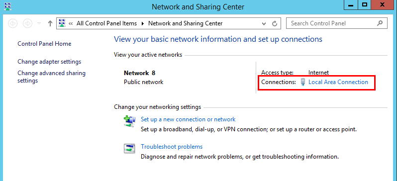
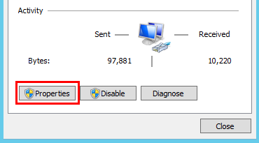
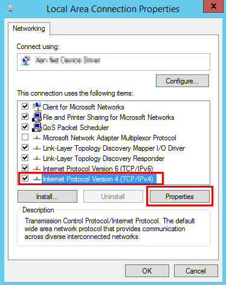
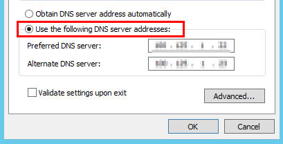

# Configuring DNS<a name="sfs_01_0038"></a>

A DNS server is used to resolve domain names of file systems.  The DNS server IP address is 100.125.4.25.

By default, the IP address of the DNS server used to resolve domain names of file systems is automatically configured on ECSs when creating ECSs. No manual configuration is needed except when the resolution fails due to a change in the DNS server IP address.

Windows 2012 is used as an example in the operation procedures for Windows.

## Procedure \(Linux\)<a name="section60237810114859"></a>

1.  Log in to the ECS as user  **root**.
2.  <a name="li13553756203149"></a>Run the  **vi /etc/resolv.conf**  command to edit the  **/etc/resolv.conf**  file. Add the DNS server IP address above the existing nameserver information. See  [Figure 1](#fig3735131720121).

    **Figure  1**  Configuring DNS<a name="fig3735131720121"></a>  
    

    The format is as follows:

    ```
    nameserver 100.125.4.25
    ```

3.  Press  **Esc**, input  **:wq**, and press  **Enter**  to save the changes and exit the vi editor.
4.  Run the following command to check whether the IP address is successfully added:

    **cat /etc/resolv.conf**

5.  Run the following command to check whether an IP address can be resolved from the file system domain name:

    **nslookup **_File system domain name_

    > **NOTE:**   
    >Obtain the file system domain name from the file system shared path.  

6.  \(Optional\) In a network environment of the DHCP server, edit the  **/etc/resolv.conf**  file to prevent the file from being automatically modified upon an ECS startup, and prevent the DNS server IP address added in  [2](#li13553756203149)  from being reset.
    1.  Run the following command to lock the file:

        **chattr +i /etc/resolv.conf**

        > **NOTE:**   
        >Run the  **chattr -i /etc/resolv.conf**  command to unlock the file if needed.  

    2.  Run the following command to check whether the editing is successful:

        **lsattr /etc/resolv.conf**

        If a command output similar to  [Figure 2](#fig46855620155120)  is displayed, the file has been locked.

        **Figure  2**  A locked file<a name="fig46855620155120"></a>  
        


## Procedure \(Windows\)<a name="section75976550455"></a>

1.  Go to the ECS console and log in to the ECS running Windows 2012.
2.  Click  **This PC**  in the lower left corner.
3.  On the page that is displayed, right-click  **Network**  and choose  **Properties**  from the drop-down list. The  **Network and Sharing Center**  page is displayed, as shown in  [Figure 3](#fig11811485719). Click  **Local Area Connection**.

    **Figure  3**  Page for network and sharing center<a name="fig11811485719"></a>  
    

4.  In the  **Activity**  area, select  **Properties**. See  [Figure 4](#fig18980173031015).

    **Figure  4**  Local area connection<a name="fig18980173031015"></a>  
    

5.  In the  **Local Area Connection Properties**  dialog box that is displayed, select  **Internet Protocol Version 4 \(TCP/IPv4\)**  and click  **Properties**. See  [Figure 5](#fig146301518171620).

    **Figure  5**  Local area connection properties<a name="fig146301518171620"></a>  
    

6.  In the dialog box that is displayed, select  **Use the following DNS server addresses:**  and configure DNS, as shown in  [Figure 6](#fig82464042713). The DNS server IP address is 100.125.4.25. After completing the configuration, click  **OK**.

    **Figure  6**  Configuring DNS on Windows<a name="fig82464042713"></a>  
    


