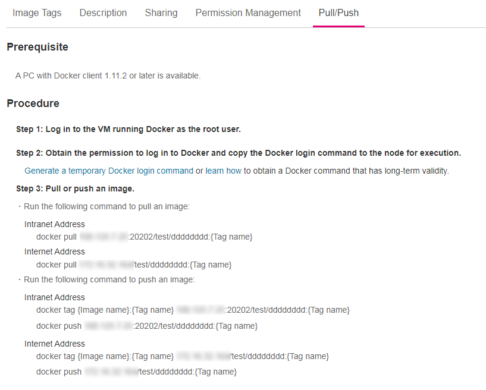

# Obtaining a Long-Term Valid Docker Login Command

This section describes how to obtain a long-term valid docker login command that will remain valid for one year.

## Procedure

1.  Obtain the regional project name and image repository address.
    1.  Access my credentials:  [https://console.otc.t-systems.com/iam/\#/myCredential](https://console.otc.t-systems.com/iam/#/myCredential).
    2.  On the  **Projects**  tab page, check the name of the project in your current region.

        For example, in region  **eu-de**, the project is called  **eu-de**.

        **Figure  1**  Region and project  
        

        Obtain the image repository address from the SWR console.

        In the navigation pane on the left, click  **My Images**. In the image list displayed, click the target image name. On the  **Pull/Push**  tab page, you can find the image repository address.

        **Figure  2**  Image repository address  
        

2.  Obtain the Access Key ID and Secret Access Key \(AK/SK\).

    > **NOTE:**   
    >If you already have an AK/SK, skip this step.  

    1.  Access my credentials:  [https://console.otc.t-systems.com/iam/\#/myCredential](https://console.otc.t-systems.com/iam/#/myCredential).
    2.  On the  **Access Keys**  tab page, click  **Create Access Key**.

        **Figure  3**  Creating an access key  
        

    3.  Enter the login password and verification code sent to your mailbox or mobile phone.

        > **NOTE:**   
        >Users created in IAM and have not bound any email addresses or mobile phone numbers only need to enter their login passwords for verification.  

    4.  Click  **OK**  to download the access key.

        > **NOTE:**   
        >Keep the key secure and do not disclose it to any unauthorized personnel.  

3.  Log in to a Linux PC and run the following command to  obtain the login key:

    **printf "_$AK_" | openssl dgst -binary -sha256 -hmac "_$SK_" | od -An -vtx1 | sed 's/\[ \\n\]//g' | sed 'N;s/\\n//'**

    In the command,  **$AK**  and  **$SK**  indicate the AK and SK obtained in step  [2](#li1863783911295)  respectively.

    **Figure  4**  Sample command output  
    

4.  The format of  **docker login**  command is as follows:

    **docker login -u** **\[**_Regional project name_**\]@\[**_AK_**\]** **-p** **\[**_Login key_**\]  \[**_Image repository address_**\]**

    In the command, the regional project name and image repository address are obtained in step  [1](#li5768123671815), the AK in step  [2](#li1863783911295), and the login key in step  [3](#li132430753010).

5.  To prevent privacy information leakage, run the  **history -c**  command to clear command history. In addition, it is advised to obtain the  **docker login**  command in the development environment.

