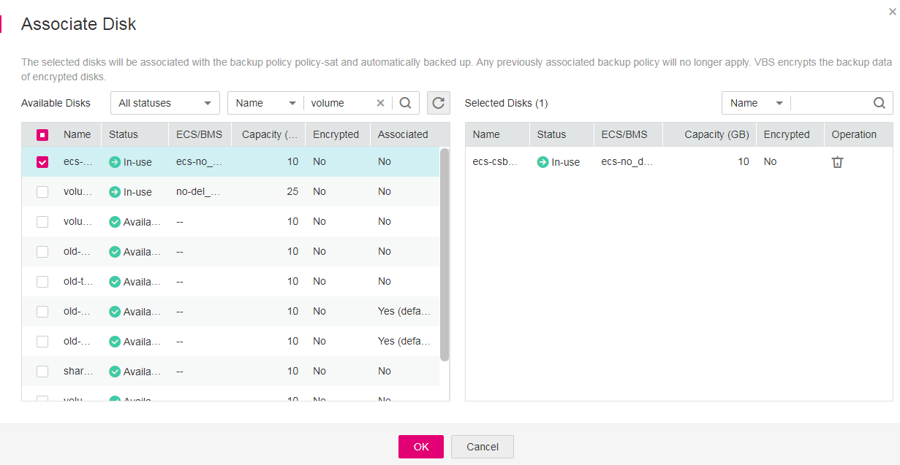

# Associating EVS Disks with a Backup Policy or Disassociating Them from a Backup Policy

After creating a backup policy, you can associate EVS disks to the backup policy. Later, the system will back up the EVS disks automatically according to the execution times specified in the backup policy. If an EVS disk no longer needs automatic backup, you can disassociate it from the backup policy.

## **Procedure**

1.  Log in to the management console.
2.  Click    in the upper left corner of the management console and select a region and a project.
3.  Click  . Under  **Storage**, click  **Volume Backup Service**.
4.  On the  **Volume Backup Service**  page, click  **Policies**  to go to the  **Policies**  tab page.
5.  Select an existing backup policy and click  . The list of associated EVS disks is displayed.
    -   Associating disks
        1.  Click  **Associate**. Alternatively, click  **Associate Disk**  in the  **Operation**  column.

            The  **Associate Disk**  dialog box is displayed listing the EVS disks.

        2.  Select the EVS disks that need to be associated with the backup policy \(EVS disks in** Awaiting transfer**,** Expansion failed**,  **Restoration failed**,  **Rollback failed**,  **Error**, or  **Deletion failed**  state cannot be associated\).

            > **NOTE:**   
            >You can select EVS disks that have been associated with other backup policies. However, the system will disassociate them from the relevant backup policies and then associate them with the new backup policy.  

        3.  Optional: In the search box above the list, select a state and specify whether to search for an EVS disk by EVS disk name, EVS disk ID, or ECS ID and enter the corresponding value to search.
        4.  Confirm the selected EVS disks to add them to the  **Selected Disks**  list on the right.
        5.  Optional: In the search box above the  **Selected Disks**  list, specify whether to search for an EVS disk by its name or ID and enter the corresponding value to search. If the EVS disk is displayed, it has been selected.
        6.  Confirm that the correct EVS disks are selected and click  **OK**  to complete the association. See  [Figure 1](#fig136560051911).

            **Figure  1**  Associating a disk  
            

            > **NOTE:**   
            >If you select a large number \(greater than 40\) of EVS disks, the association operation may take a long time and a dialog box is displayed asking you whether to continue the association operation. Click  **OK**  to continue.  

        7.  Ensure that the backup policy is enabled. When the point in time specified by the backup policy arrives, select the backup policy. Then on the  **Backup Jobs**  panel, ensure that a backup job is generated.
        8.  On the VBS backup list, locate the needed backup according to  **Name**  \(the  **Backup Name**  specified in the backup job\). When the  **Status**  is  **Available**, the backup job of the associated EVS disks is complete.

    -   Disassociating EVS disks
        1.  In the list of associated EVS disks, locate the EVS disk to be disassociated from the backup policy and click  **Disassociate**  in the  **Operation**  column.

            The  **Disassociate Disk**  dialog box is displayed. 

        2.  Optional: In the list of associated EVS disks, select one or more EVS disks to be disassociated from the backup policy and click  **Disassociate**  above the list.

            The  **Disassociate Disk**  dialog box is displayed.

        3.  Confirm the EVS disk information and click  **OK**.

            The  **Associated Disks**  panel does not display the EVS disks that are disassociated from this backup policy.

