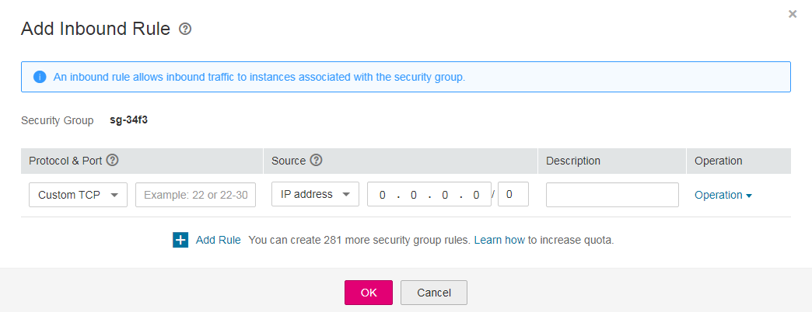
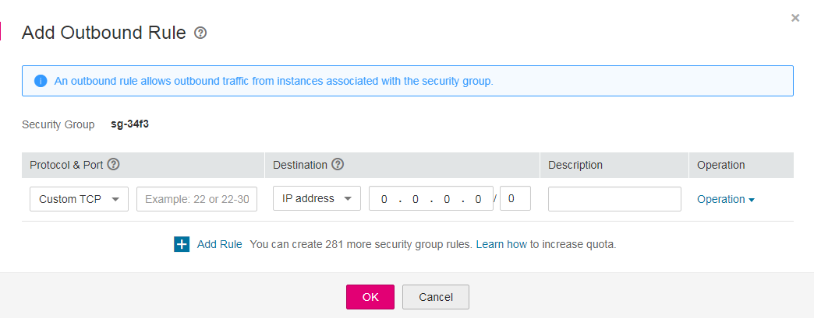

# Adding a Security Group Rule

## Scenarios

After a security group is created, it has default rules. You can add new inbound and outbound rules to the security group.

-   Inbound rules control incoming traffic to servers in the security group.
-   Outbound rules control outgoing traffic from servers in the security group.

## Procedure

1.  Log in to the management console.
2.  Click    in the upper left corner and select the desired region and project.
3.  On the console homepage, under  **Network**, click **Virtual Private Cloud**.
4.  In the navigation pane on the left, click  **Security Group**.
5.  On the  **Security Group** page, locate the target security group and click **Manage Rule** in the **Operation**  column to switch to the page for managing inbound and outbound rules.
6.  On the  **Inbound** tab, click **Add Rule**. In the displayed dialog box, set required parameters to add an inbound rule.

    You can click  **+**  to add more inbound rules.

    **Figure  1**  Add Inbound Rule
    

    **Table  1**  Inbound rule parameter description

    <table><thead align="left"><tr id="en-us_topic_0030969470_row731911191722"><th class="cellrowborder" valign="top" width="28.299999999999997%" id="mcps1.2.4.1.1">
<strong id="en-us_topic_0030969470_b842352706114331">Parameter</strong>

    </th>
    <th class="cellrowborder" valign="top" width="53.7%" id="mcps1.2.4.1.2">
<strong id="en-us_topic_0030969470_b84235270694155">Description</strong>

    </th>
    <th class="cellrowborder" valign="top" width="18%" id="mcps1.2.4.1.3">
<strong id="en-us_topic_0030969470_b8423527069420">Example Value</strong>

    </th>
    </tr>
    </thead>
    <tbody><tr id="en-us_topic_0030969470_row8320419723"><td class="cellrowborder" valign="top" width="28.299999999999997%" headers="mcps1.2.4.1.1 ">
Protocol/Application

    </td>
    <td class="cellrowborder" valign="top" width="53.7%" headers="mcps1.2.4.1.2 ">
Specifies the network protocol for which the security group rule takes effect. The value can be <strong id="en-us_topic_0030969470_b84235270613479">TCP</strong>,&nbsp;<strong id="en-us_topic_0030969470_b842352706134713">UDP</strong>,&nbsp;<strong id="en-us_topic_0030969470_b842352706134716">ICMP</strong>, or&nbsp;<strong id="en-us_topic_0030969470_b842352706134721">ANY</strong>.

    </td>
    <td class="cellrowborder" valign="top" width="18%" headers="mcps1.2.4.1.3 ">
TCP

    </td>
    </tr>
    <tr id="en-us_topic_0030969470_row1732101910217"><td class="cellrowborder" valign="top" width="28.299999999999997%" headers="mcps1.2.4.1.1 ">
Port Range/ICMP Type

    </td>
    <td class="cellrowborder" valign="top" width="53.7%" headers="mcps1.2.4.1.2 ">
Specifies the port or port range for which the security group rule takes effect. The value ranges from <strong id="en-us_topic_0030969470_b842352706135645">1</strong>&nbsp;to&nbsp;<strong id="en-us_topic_0030969470_b842352706135649">65535</strong>.

    </td>
    <td class="cellrowborder" valign="top" width="18%" headers="mcps1.2.4.1.3 ">
22 or 22-30

    </td>
    </tr>
    <tr id="en-us_topic_0030969470_row2032111191124"><td class="cellrowborder" valign="top" width="28.299999999999997%" headers="mcps1.2.4.1.1 ">
Source

    </td>
    <td class="cellrowborder" valign="top" width="53.7%" headers="mcps1.2.4.1.2 ">
Specifies the source of the security group rule. The value can be an IP address or a security group.

    
For example:

    
xxx.xxx.xxx.xxx/32 (IPv4 address)

    
xxx.xxx.xxx.0/24 (subnet)

    
0.0.0.0/0 (any IP address)

    </td>
    <td class="cellrowborder" valign="top" width="18%" headers="mcps1.2.4.1.3 ">
0.0.0.0/0

    
default

    </td>
    </tr>
    <tr id="en-us_topic_0030969470_row1844612518515"><td class="cellrowborder" valign="top" width="28.299999999999997%" headers="mcps1.2.4.1.1 ">
Description

    </td>
    <td class="cellrowborder" valign="top" width="53.7%" headers="mcps1.2.4.1.2 ">
Provides supplementary information about the security group. This parameter is optional.

    
The security group description can contain a maximum of 255 characters and cannot contain angle brackets (&lt;) or (&gt;).

    </td>
    <td class="cellrowborder" valign="top" width="18%" headers="mcps1.2.4.1.3 ">
N/A

    </td>
    </tr>
    </tbody>
    </table>

7.  On the  **Outbound** tab, click **Add Rule**. In the displayed dialog box, set required parameters to add an outbound rule.

    You can click  **+**  to add more outbound rules.

    **Figure  2**  Add Outbound Rule
    

    **Table  2**  Outbound rule parameter description

    <table><thead align="left"><tr id="en-us_topic_0030969470_row1689515114136"><th class="cellrowborder" valign="top" width="28.299999999999997%" id="mcps1.2.4.1.1">
<strong id="en-us_topic_0030969470_b842352706114331_1">Parameter</strong>

    </th>
    <th class="cellrowborder" valign="top" width="53.7%" id="mcps1.2.4.1.2">
<strong id="en-us_topic_0030969470_b84235270694155_1">Description</strong>

    </th>
    <th class="cellrowborder" valign="top" width="18%" id="mcps1.2.4.1.3">
<strong id="en-us_topic_0030969470_b8423527069420_1">Example Value</strong>

    </th>
    </tr>
    </thead>
    <tbody><tr id="en-us_topic_0030969470_row139013518139"><td class="cellrowborder" valign="top" width="28.299999999999997%" headers="mcps1.2.4.1.1 ">
Protocol/Application

    </td>
    <td class="cellrowborder" valign="top" width="53.7%" headers="mcps1.2.4.1.2 ">
Specifies the network protocol for which the security group rule takes effect. The value can be <strong id="en-us_topic_0030969470_b84235270613479_1">TCP</strong>,&nbsp;<strong id="en-us_topic_0030969470_b842352706134713_1">UDP</strong>,&nbsp;<strong id="en-us_topic_0030969470_b842352706134716_1">ICMP</strong>, or&nbsp;<strong id="en-us_topic_0030969470_b842352706134721_1">ANY</strong>.

    </td>
    <td class="cellrowborder" valign="top" width="18%" headers="mcps1.2.4.1.3 ">
TCP

    </td>
    </tr>
    <tr id="en-us_topic_0030969470_row159061451141316"><td class="cellrowborder" valign="top" width="28.299999999999997%" headers="mcps1.2.4.1.1 ">
Port Range/ICMP Type

    </td>
    <td class="cellrowborder" valign="top" width="53.7%" headers="mcps1.2.4.1.2 ">
Specifies the port or port range for which the security group rule takes effect. The value ranges from <strong id="en-us_topic_0030969470_b842352706135645_1">1</strong>&nbsp;to&nbsp;<strong id="en-us_topic_0030969470_b842352706135649_1">65535</strong>.

    </td>
    <td class="cellrowborder" valign="top" width="18%" headers="mcps1.2.4.1.3 ">
22 or 22-30

    </td>
    </tr>
    <tr id="en-us_topic_0030969470_row1491445114138"><td class="cellrowborder" valign="top" width="28.299999999999997%" headers="mcps1.2.4.1.1 ">
Destination

    </td>
    <td class="cellrowborder" valign="top" width="53.7%" headers="mcps1.2.4.1.2 ">
Specifies the destination of the security group rule. The value can be an IP address or a security group.

    
For example:

    
xxx.xxx.xxx.xxx/32 (IPv4 address)

    
xxx.xxx.xxx.0/24 (subnet)

    
0.0.0.0/0 (any IP address)

    </td>
    <td class="cellrowborder" valign="top" width="18%" headers="mcps1.2.4.1.3 ">
0.0.0.0/0

    
default

    </td>
    </tr>
    <tr id="en-us_topic_0030969470_row139271451151311"><td class="cellrowborder" valign="top" width="28.299999999999997%" headers="mcps1.2.4.1.1 ">
Description

    </td>
    <td class="cellrowborder" valign="top" width="53.7%" headers="mcps1.2.4.1.2 ">
Provides supplementary information about the security group. This parameter is optional.

    
The security group description can contain a maximum of 255 characters and cannot contain angle brackets (&lt;) or (&gt;).

    </td>
    <td class="cellrowborder" valign="top" width="18%" headers="mcps1.2.4.1.3 ">
N/A

    </td>
    </tr>
    </tbody>
    </table>

