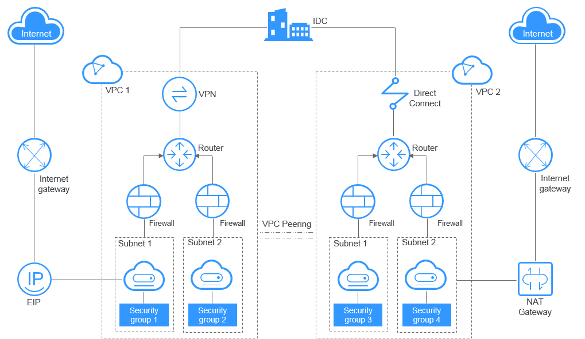

# What Is Virtual Private Cloud?

The Virtual Private Cloud \(VPC\) service enables you to provision logically isolated, configurable, and manageable virtual networks for Elastic Cloud Servers \(ECSs\), improving the security of resources in the cloud system and simplifying network deployment.

You can create security groups and VPNs, configure IP address ranges, and specify bandwidth sizes in your VPC. A VPC facilitates internal network management and configuration, and allows you to implement secure and quick network changes. You can also customize the ECS access rules within a security group and between security groups to improve ECS security.

**Figure  1**  VPC components

Accessing the VPC

Web-based service management platforms, including the management console and HTTPS-based application programming interface \(API\), are provided for you to access the VPC service. The detailed methods for accessing the VPC service are as follows:

-   API

    If you need to integrate the VPC service provided by the public cloud system into a third-party system for secondary development, you can use the API to access the VPC service. For details, see the  _Virtual Private Cloud API Reference_.

-   Management console

    You can log in to the management console to perform other required operations on the VPC service. You can access the VPC service by logging in to the management console and selecting  **Virtual Private Cloud**  from the console homepage.

