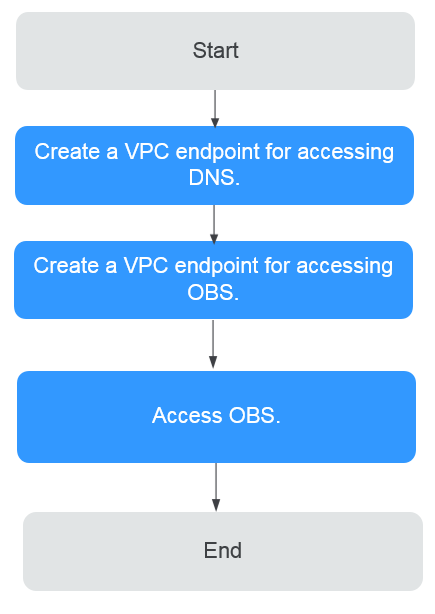

# Overview

## Scenarios

To connect your local data center to a cloud service like OBS using a VPN connection or a direct connection over internal networks, you can create a VPC endpoint.

A VPC endpoint always comes with a VPC endpoint service. Before creating a VPC endpoint, you need to ensure that the VPC endpoint service to be connected is already created.

The VPC endpoint services used in this scenario are as follows:

-   **com.t-systems.otc.eu-de.dns**: resolves OBS domain names at your local data center.
-   **com.t-systems.otc.eu-de.obs**: functions as the OBS service for users to access.

This section describes how to use a VPC endpoint to connect your local data center to cloud services using a VPN connection or a direct connection, for example, OBS.

## Prerequisites

-   Your local data center has been connected to your VPC using a VPN connection or a direct connection.
    -   The local subnet of your VPC that interconnects with your VPN connection contains the OBS CIDR block 100.125.0.0/16.

        For details about how to create a VPN, see  [Creating a VPN](https://docs.otc.t-systems.com/en-us/usermanual/vpn/en-us_topic_0060118606.html).

    -   The CIDR block of the virtual gateway associated with your direct connection contains the OBS CIDR block 100.125.0.0/16.

        For details about how to enable Direct Connect, see  [Getting Started](https://docs.otc.t-systems.com/en-us/usermanual/dc/en-us_topic_0032025289.html).

-   The target VPC endpoint service already exists.

## Operation Process

[Figure 1](#fig11842192183914)  shows the VPC endpoint configuration process.

**Figure  1**  VPC endpoint configuration process  

