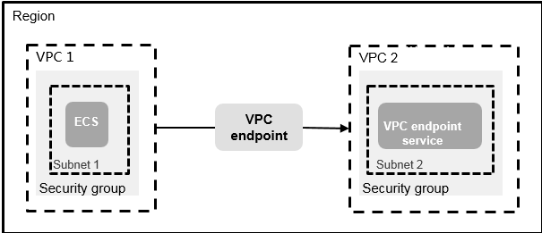

# Overview

VPCEP supports cross-VPC communication. With VPCEP, two VPCs created by the same domain or different domains can communicate with each other. You can use a private IP address to access resources across the two VPCs despite of the network isolation between them.

[Figure 1](#fig493595712121)  shows the topology, indicating how an ECS in VPC1 accesses a VPC endpoint service in VPC2 using a VPC endpoint.

**Figure  1**  Configuring a VPC endpoint for communication across VPCs  

> **NOTE:** 
>This section describes how to configure VPC endpoints for communication across VPCs in the same region.

