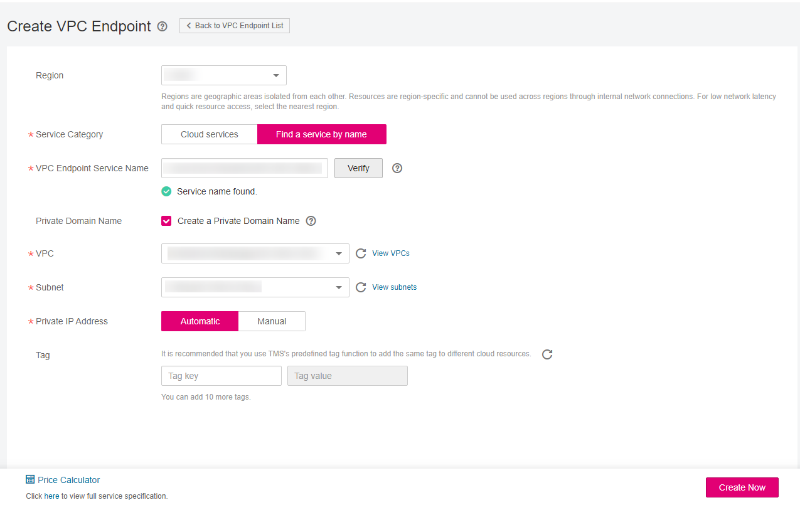
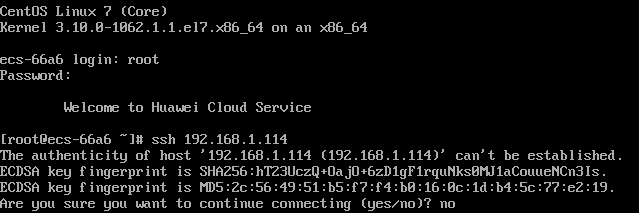

# Step 2: Create a VPC Endpoint

## Scenarios

This section describes how to create a VPC endpoint in another VPC of your own for connecting to the VPC endpoint service.

## Procedure

1.  In the navigation pane on the left, choose  **VPC Endpoint**  \>  **VPC Endpoints**.
2.  On the displayed page, click  **Create VPC Endpoint**.

    **Figure  1**  Create VPC Endpoint  
    

3.  Configure parameters by referring to  [Table 1](#table1449016525218).

    **Table  1**  Required parameters

    
    <table><thead align="left"><tr id="row448845216214"><th class="cellrowborder" valign="top" width="19.950000000000003%" id="mcps1.2.3.1.1">
<strong id="b142371120101315">Parameter</strong>

    </th>
    <th class="cellrowborder" valign="top" width="80.05%" id="mcps1.2.3.1.2">
<strong id="b427715218136">Description</strong>

    </th>
    </tr>
    </thead>
    <tbody><tr id="row74887527213"><td class="cellrowborder" valign="top" width="19.950000000000003%" headers="mcps1.2.3.1.1 ">
Region

    </td>
    <td class="cellrowborder" valign="top" width="80.05%" headers="mcps1.2.3.1.2 ">
Specifies the region where the VPC endpoint is located. This region is the same as that of the VPC endpoint service.

    </td>
    </tr>
    <tr id="row13489105218217"><td class="cellrowborder" valign="top" width="19.950000000000003%" headers="mcps1.2.3.1.1 ">
Service Category

    </td>
    <td class="cellrowborder" valign="top" width="80.05%" headers="mcps1.2.3.1.2 ">
There are two options: <strong id="b48876464323">Cloud services</strong> or <strong id="b48882046133212">Find a service by name</strong>.

    <ul id="ul033017631615"><li><strong id="b132155102155">Cloud services</strong>: Select this value if the target VPC endpoint service is a cloud service.</li><li><strong id="b1574221311159">Find a service by name</strong>: Select this value if the target VPC endpoint service is a private service of your own.</li></ul>
    
Example: <strong id="b1633955318321">Find a service by name</strong>

    </td>
    </tr>
    <tr id="row1148995216218"><td class="cellrowborder" valign="top" width="19.950000000000003%" headers="mcps1.2.3.1.1 ">
VPC Endpoint Service Name

    </td>
    <td class="cellrowborder" valign="top" width="80.05%" headers="mcps1.2.3.1.2 ">
This parameter is available only if you select <strong id="b151101933280">Find a service by name</strong> for <strong id="b8111638289">Service Category</strong>.

    
Enter the VPC endpoint service name recorded in step <a href="step-1-create-a-vpc-endpoint-service.md#li837613314320">8</a>, for example, <strong id="b152951244733">eu-de.69e93219-e3ad-43b9-8416-9d788319ac9f</strong> and click <strong id="b1833816415591">Verify</strong>.

    <ul id="ul2413202710255"><li>If <strong id="b12495239125617">Service name found</strong> is displayed, proceed with subsequent operations.</li><li>If <strong id="b79601041205611">Service name not found</strong> is displayed, check whether the region is the same as that of the connected VPC endpoint service or whether the entered service name is correct.</li></ul>
    </td>
    </tr>
    <tr id="row24891452828"><td class="cellrowborder" valign="top" width="19.950000000000003%" headers="mcps1.2.3.1.1 ">
Private Domain Name

    </td>
    <td class="cellrowborder" valign="top" width="80.05%" headers="mcps1.2.3.1.2 ">
If you want to access a VPC endpoint using a domain name, select <strong id="b136998229533">Create a Private Domain Name</strong> when creating a VPC endpoint. After the VPC endpoint is created, you can access it using the domain name.

    <ul id="ul102191581715"><li>For a target VPC endpoint service that is a gateway, this parameter is unavailable.</li><li>For a target VPC endpoint service that is an interface, this parameter is optional.</li></ul>
    </td>
    </tr>
    <tr id="row16489145215218"><td class="cellrowborder" valign="top" width="19.950000000000003%" headers="mcps1.2.3.1.1 ">
VPC

    </td>
    <td class="cellrowborder" valign="top" width="80.05%" headers="mcps1.2.3.1.2 ">
Specifies the VPC where the VPC endpoint is located.

    </td>
    </tr>
    <tr id="row20490115211211"><td class="cellrowborder" valign="top" width="19.950000000000003%" headers="mcps1.2.3.1.1 ">
Subnet

    </td>
    <td class="cellrowborder" valign="top" width="80.05%" headers="mcps1.2.3.1.2 ">
Specifies the subnet where the VPC endpoint is located.

    </td>
    </tr>
    <tr id="row149146382217"><td class="cellrowborder" valign="top" width="19.950000000000003%" headers="mcps1.2.3.1.1 ">
Private IP Address

    </td>
    <td class="cellrowborder" valign="top" width="80.05%" headers="mcps1.2.3.1.2 ">
This parameter is available only if you create a VPC endpoint for connecting to an interface VPC endpoint service.

    
Specifies the private IP address of the VPC endpoint. You can select <strong id="b55051336144910">Automatic</strong> or <strong id="b1151983617499">Manual</strong>.

    </td>
    </tr>
    <tr id="row74909521922"><td class="cellrowborder" valign="top" width="19.950000000000003%" headers="mcps1.2.3.1.1 ">
Tag

    </td>
    <td class="cellrowborder" valign="top" width="80.05%" headers="mcps1.2.3.1.2 ">
This parameter is optional.

    
Specifies the VPC endpoint tag, which consists of a key and a value. You can add a maximum of 10 tags to each VPC endpoint.

    
Tag keys and values must meet requirements listed in <a href="#table1349117521628">Table 2</a>.

    
 NOTE: 

If a predefined tag has been created on TMS, you can directly select the corresponding tag key and value.

    
For details about predefined tags, see <a href="https://docs.otc.t-systems.com/usermanual/tms/en-us_topic_0056266269.html" target="_blank" rel="noopener noreferrer">Predefined Tag Overview</a>.

    

    </td>
    </tr>
    </tbody>
    </table>

    **Table  2**  Tag requirements for VPC endpoints

    
    <table><thead align="left"><tr id="vpcep_02_0302_row1975492119112"><th class="cellrowborder" valign="top" width="42.63%" id="mcps1.2.3.1.1">
<strong id="vpcep_02_0302_b116044234515">Parameter</strong>

    </th>
    <th class="cellrowborder" valign="top" width="57.37%" id="mcps1.2.3.1.2">
<strong id="vpcep_02_0302_b134861185457">Requirement</strong>

    </th>
    </tr>
    </thead>
    <tbody><tr id="vpcep_02_0302_row1375419211915"><td class="cellrowborder" valign="top" width="42.63%" headers="mcps1.2.3.1.1 ">
Tag key

    </td>
    <td class="cellrowborder" valign="top" width="57.37%" headers="mcps1.2.3.1.2 "><ul id="vpcep_02_0302_ul182248574315"><li>Cannot be left blank.</li><li>Must be unique for the same VPC endpoint.</li><li>Contains a maximum of 36 characters and only allows the following characters:<ul id="vpcep_02_0302_ul15224957937"><li>Uppercase letters</li><li>Lowercase letters</li><li>Digits</li><li>Special characters, including hyphens (-) and underscores (_)</li></ul>
    </li></ul>
    </td>
    </tr>
    <tr id="vpcep_02_0302_row97543211410"><td class="cellrowborder" valign="top" width="42.63%" headers="mcps1.2.3.1.1 ">
Tag value

    </td>
    <td class="cellrowborder" valign="top" width="57.37%" headers="mcps1.2.3.1.2 ">
Contains a maximum of 43 characters and only allows the following characters:<ul id="vpcep_02_0302_ul19120173116418"><li>Uppercase letters</li><li>Lowercase letters</li><li>Digits</li><li>Special characters, including hyphens (-) and underscores (_)</li></ul>
    

    </td>
    </tr>
    </tbody>
    </table>

4.  Confirm the specifications and click  **Create Now**.
    -   If all of the specifications are correct, click  **Submit**.
    -   If any of the specifications are incorrect, click  **Previous**  to return to the previous page and modify the parameters as needed, and then click  **Submit**.

5.  Manage the connection of the VPC endpoint.

    If the status of the VPC endpoint changes to  **Accepted**, the VPC endpoint is connected to the desired VPC endpoint service. If the status is  **Pending acceptance**, connection approval is enabled for the endpoint service and you need to contact the owner of the endpoint service and ask the owner to perform the following operations:

    1.  In the navigation pane on the left, choose  **VPC Endpoint**  \>  **VPC Endpoint Services**.
    2.  In the VPC endpoint service list, locate the target VPC endpoint service and click its name.
    3.  On the displayed page, select the  **Connection Management**  tab.
        -   If you allow a VPC endpoint to connect to this VPC endpoint service, locate the target VPC endpoint and click  **Accept**  in the  **Operation**  column.
        -   If you refuse a VPC endpoint from connecting to this VPC endpoint service, click  **Reject**  in the  **Operation**  column.

    4.  Go back to the VPC endpoint list and check whether the status of the target VPC endpoint changes to  **Accepted**. If yes, the VPC endpoint is connected to the VPC endpoint service.

6.  In the VPC endpoint list, click the ID of the target VPC endpoint to view its details.

    After a VPC endpoint is created, a private IP address and a private domain name are generated if you select  **Create a Private Domain Name**  during creation.

    **Figure  2**  Summary of the VPC endpoint  
    

    You can use the private IP address or private domain name to access the VPC endpoint service.

## Configuration Verification

Log in to an ECS in VPC1 in remote mode and access the VPC endpoint using its private IP address or private domain name.

**Figure  3**  Logging in to the ECS to access the VPC endpoint  

