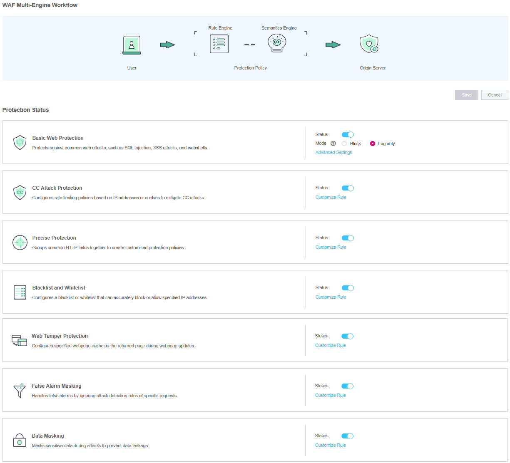
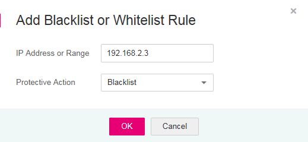

# Configuring Blacklist or Whitelist Rules

This section describes how to configure  blacklist or whitelist  rules to block or allow specific IP addresses or address ranges.

Blacklist and Whitelist  only takes effect for specified domain names.

## Prerequisites

-   Login credentials have been obtained.
-   The domain name to be protected has been created.

## Procedure

1.  Log in to the management console.
2.  Click    in the upper left corner of the management console and select a region or project.
3.  Click  **Service List**  at the top of the page and choose  **Security**  \>  **Web Application Firewall**. In the navigation pane, choose  **Domains**. The  **Domains**  page is displayed, as shown in  [Figure 1](#waf_01_0008_fig164792010154510).

    **Figure  1**  Entrance to the domain configuration page  
    

4.  In the  **Operation**  column of the row containing the target domain name, click  **Configure Policy**. The protection configuration page is displayed, as shown in  [Figure 2](#waf_01_0008_fig16197124372015).

    **Figure  2**  Protection configuration page  
    

5.  In the  **Blacklist and Whitelist**  configuration area, change  **Status**  as needed and then click  **Save**  in the upper right corner of the  **Protection Status**  list. In the dialog box displayed, click  **Yes**  to save the settings. Otherwise, click  **Cancel**. See  [Figure 3](#fig0358162863015).

    **Figure  3**  Blacklist and Whitelist configuration area  
    

6.  Click  **Customize Rule**. On the displayed page, click  **Add Rule**  in the upper left corner to add a blacklist or whitelist rule. See  [Figure 4](#fig337411411269).

    > **NOTE:**   
    >If you do not click  **Save**  after changing  **Status**  in  [step 5](#li33536816115011), the  **Warning**  dialog box is displayed when you click  **Customize Rule**.  
    >-   Click  **Yes**  to cancel the previous settings.  
    >-   Click  **No**  and then  **Save**  to save the settings.  

    **Figure  4**  Add Rule \(Blacklist and Whitelist\)  
    .png "add-rule-(blacklist-and-whitelist)")

7.  In the displayed dialog box shown in  [Figure 5](#fig22686744114137), specify the parameters by referring to  [Table 1](#table27095251482).

    **Figure  5**  Adding a blacklist or whitelist rule  
    

    **Table  1**  Rule parameters

    
    <table><thead align="left"><tr id="row137101425382"><th class="cellrowborder" valign="top" width="18.81188118811881%" id="mcps1.2.4.1.1">
Parameter

    </th>
    <th class="cellrowborder" valign="top" width="36.583658365836584%" id="mcps1.2.4.1.2">
Description

    </th>
    <th class="cellrowborder" valign="top" width="44.604460446044605%" id="mcps1.2.4.1.3">
Example Value

    </th>
    </tr>
    </thead>
    <tbody><tr id="row20711192519818"><td class="cellrowborder" valign="top" width="18.81188118811881%" headers="mcps1.2.4.1.1 ">
IP Address or Range

    </td>
    <td class="cellrowborder" valign="top" width="36.583658365836584%" headers="mcps1.2.4.1.2 "><ul id="ul129831037141019"><li>IP address: IP address to be added to the blacklist or whitelist</li><li>IP address range: IP address and subnet mask defining a network segment</li></ul>
    </td>
    <td class="cellrowborder" valign="top" width="44.604460446044605%" headers="mcps1.2.4.1.3 "><ul id="ul77819464108"><li><strong id="b19851853123111">192.168.2.3</strong></li><li><strong id="b132423494412">10.1.1.0/24</strong></li></ul>
    </td>
    </tr>
    <tr id="row290515450818"><td class="cellrowborder" valign="top" width="18.81188118811881%" headers="mcps1.2.4.1.1 ">
Protective Action

    </td>
    <td class="cellrowborder" valign="top" width="36.583658365836584%" headers="mcps1.2.4.1.2 ">
If <strong id="b256050404144042">IP Address or Range</strong> is to be added to a whitelist, set this parameter to <strong id="b842352706144133">Whitelist</strong>.

    
If <strong id="b533344072144151">IP Address or Range</strong> is to be added to a blacklist, set this parameter to <strong id="b1340077337144151">Blacklist</strong>.

    </td>
    <td class="cellrowborder" valign="top" width="44.604460446044605%" headers="mcps1.2.4.1.3 ">
<b>Blacklist</b>

    </td>
    </tr>
    </tbody>
    </table>

8.  Click  **OK**.
    -   To modify the added rule, click  **Modify**  in the row containing the target rule.
    -   To delete the added rule, click  **Delete**  in the row containing the target rule.

