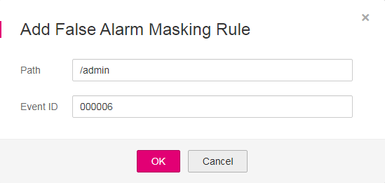

# Configuring False Alarm Masking Rules

This section describes how to configure  false alarm masking  rules.

You can add false alarms to the whitelist and ignore certain rule IDs \(for example, skip XSS check for a specified URL\).

## Prerequisites

-   Login credentials have been obtained.
-   The domain name to be protected has been created.

## Procedure

1.  Log in to the management console.
2.  Click    in the upper left corner of the management console and select a region or project.
3.  Click  **Service List**  at the top of the page and choose  **Security**  \>  **Web Application Firewall**. In the navigation pane, choose  **Domains**. The  **Domains**  page is displayed, as shown in  [Figure 1](#en-us_topic_0193630287_fig4838162174519).

    **Figure  1**  Domains  
    

4.  In the  **Operation**  column of the row containing the target domain name, click  **Configure Policy**. The protection configuration page is displayed, as shown in  [Figure 2](#en-us_topic_0193630287_fig16197124372015).

    **Figure  2**  Protection configuration page  
    

5.  In the  **False Alarm Masking**  configuration area, change  **Status**  as needed and then click  **Save**  in the upper right corner of the  **Protection Status**  list. In the dialog box displayed, click  **Yes**  to save the settings. Otherwise, click  **Cancel**. See  [Figure 3](#fig44151977327).

    **Figure  3**  False Alarm Masking configuration area  
    

6.  Click  **Customize Rule**. On the displayed page, click  **Add Rule**  in the upper left corner to add a false alarm masking rule. See  [Figure 4](#fig106802271583).

    > **NOTE:**   
    >If you do not click  **Save**  after changing  **Status**  in  [step 5](#li58723545102836), the  **Warning**  dialog box is displayed when you click  **Customize Rule**.  
    >-   Click  **Yes**  to cancel the previous settings.  
    >-   Click  **No**  and then  **Save**  to save the settings.  

    **Figure  4**  Add Rule \(false alarm masking\)  
    .png "add-rule-(false-alarm-masking)")

7.  In the displayed dialog box shown in  [Figure 5](#fig14415389105236), specify the parameters by referring to  [Table 1](#table4696626918715).

    **Figure  5**  Adding a false alarm masking rule  
    

    **Table  1**  Rule parameters

    
    <table><thead align="left"><tr id="row151760118715"><th class="cellrowborder" valign="top" width="23.84%" id="mcps1.2.4.1.1">
Parameter

    </th>
    <th class="cellrowborder" valign="top" width="44.21%" id="mcps1.2.4.1.2">
Description

    </th>
    <th class="cellrowborder" valign="top" width="31.95%" id="mcps1.2.4.1.3">
Example Value

    </th>
    </tr>
    </thead>
    <tbody><tr id="row125751318715"><td class="cellrowborder" valign="top" width="23.84%" headers="mcps1.2.4.1.1 ">
Path

    </td>
    <td class="cellrowborder" valign="top" width="44.21%" headers="mcps1.2.4.1.2 ">
Misreported URL excluding a domain name

    <ul id="ul1515617591337"><li>Prefix match: The path ending with * indicates that the path is used as a prefix. For example, if the path to be protected is <strong id="b76511353115">/admin/test.php</strong> or <strong id="b17651205114">/adminabc</strong>, set <strong id="b16511154110">Path</strong> to <b>/admin*</b>.</li><li>Exact match: The path to be entered must match the path to be protected. If the path to be protected is <b>/admin</b>, set <strong id="b15579106114">Path</strong> to <b>/admin</b>.</li></ul>
    
 NOTE: 
<ul id="ul20707155819344"><li>The path supports prefix and exact matches only and does not support regular expressions.</li><li>The path cannot contain two or more consecutive slashes. For example, <b>///admin</b>. If you enter <strong id="b1878115110573">///admin</strong>, the WAF engine converts <strong id="b19787513575">///</strong> to <strong id="b1478451105713">/</strong>.</li></ul>
    

    </td>
    <td class="cellrowborder" valign="top" width="31.95%" headers="mcps1.2.4.1.3 ">
<strong id="b178411434203019">/admin</strong>

    
For example, if the URL to be protected is <b>http://www.example.com/admin</b>, set <strong id="b9343124145815">Path</strong> to <strong id="b4343164105816">/admin</strong>.

    </td>
    </tr>
    <tr id="row3251580618715"><td class="cellrowborder" valign="top" width="23.84%" headers="mcps1.2.4.1.1 ">
Event ID

    </td>
    <td class="cellrowborder" valign="top" width="44.21%" headers="mcps1.2.4.1.2 ">
ID of a misreported event in <strong id="b1383471217119">Events</strong> whose type is not <strong id="b58421127117">Custom</strong>.

    
Click <strong id="b84235270619268">Handle False Alarm</strong> in the row containing the attack event to obtain the event ID.

    
This value consists of six digits and cannot be empty.

    </td>
    <td class="cellrowborder" valign="top" width="31.95%" headers="mcps1.2.4.1.3 ">
<strong id="b13249101223112">000006</strong>

    </td>
    </tr>
    </tbody>
    </table>

8.  Click  **OK**. If  **Rule added successfully**  is displayed in the upper right corner, the rule is added.

    To delete the added rule, click  **Delete**  in the row containing the target rule.

