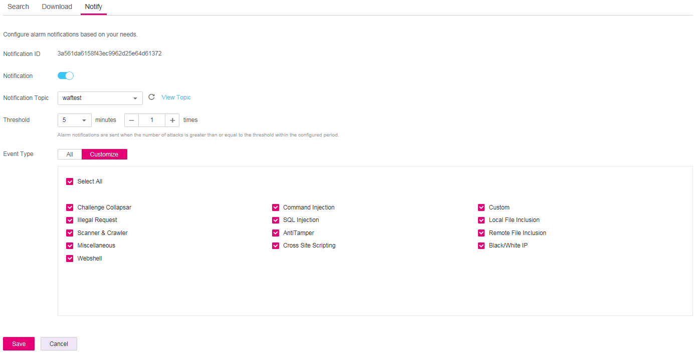

# Enabling Alarm Notification

This section describes how to enable notification for attack logs. Once this function is enabled, WAF sends attack logs to users by email or SMS.

## Prerequisites

-   Login credentials have been obtained.
-   The SMN service has been enabled.

## Procedure

1.  Log in to the management console.
2.  Click    in the upper left corner of the management console and select a region or project.
3.  Choose  **Security**  \>  **Web Application Firewall**. In the navigation pane, choose  **Events**. The  **Events**  page is displayed.
4.  Click the  **Notify**  tab and configure alarm notification parameters by referring to  [Table 1](#table4725363915334)  \(see  [Figure 1](#fig40676821112218)\).

    **Figure  1**  Configuring alarm notification  
    

    **Table  1**  Notification setting parameters

    
    <table><thead align="left"><tr id="row4914351215334"><th class="cellrowborder" valign="top" width="34.97%" id="mcps1.2.3.1.1">
Parameter

    </th>
    <th class="cellrowborder" valign="top" width="65.03%" id="mcps1.2.3.1.2">
Description

    </th>
    </tr>
    </thead>
    <tbody><tr id="row8143191772214"><td class="cellrowborder" valign="top" width="34.97%" headers="mcps1.2.3.1.1 ">
Notification ID

    </td>
    <td class="cellrowborder" valign="top" width="65.03%" headers="mcps1.2.3.1.2 ">
Alarm event ID

    </td>
    </tr>
    <tr id="row5386527415334"><td class="cellrowborder" valign="top" width="34.97%" headers="mcps1.2.3.1.1 ">
Notification

    </td>
    <td class="cellrowborder" valign="top" width="65.03%" headers="mcps1.2.3.1.2 ">
Whether to enable notification

    <ul id="ul131371286465"><li>: enabled.</li><li>: disabled.</li></ul>
    </td>
    </tr>
    <tr id="row6597002315334"><td class="cellrowborder" valign="top" width="34.97%" headers="mcps1.2.3.1.1 ">
Notification Topic

    </td>
    <td class="cellrowborder" valign="top" width="65.03%" headers="mcps1.2.3.1.2 ">
Click the drop-down list to select an available topic or click <strong id="b842352706155449">View Topic</strong> to create a topic.

    
For more information, see the <i><cite id="citeb870b1acd70f447f813c713cd94420d1173137">Simple Message Notification User Guide</cite></i>.

    </td>
    </tr>
    <tr id="row2091915305414"><td class="cellrowborder" valign="top" width="34.97%" headers="mcps1.2.3.1.1 ">
Threshold

    </td>
    <td class="cellrowborder" valign="top" width="65.03%" headers="mcps1.2.3.1.2 ">
Alarm threshold

    
 NOTE: 

Alarm notifications are sent when the number of attacks is greater than or equal to the threshold within the configured period.

    

    </td>
    </tr>
    <tr id="row7449192820129"><td class="cellrowborder" valign="top" width="34.97%" headers="mcps1.2.3.1.1 ">
Event Type

    </td>
    <td class="cellrowborder" valign="top" width="65.03%" headers="mcps1.2.3.1.2 ">
By default, <strong id="b3979810418">All</strong> is selected. You can also click <strong id="b12976814419">Customize</strong> to specify event types.

    
For details about event types, see <a href="#table1553610114533">Table 2</a>.

    </td>
    </tr>
    </tbody>
    </table>

    **Table  2**  List of event types

    
    <table><thead align="left"><tr id="row1453912185318"><th class="cellrowborder" valign="top" width="32.87%" id="mcps1.2.3.1.1">
Event Type

    </th>
    <th class="cellrowborder" valign="top" width="67.13%" id="mcps1.2.3.1.2">
Description

    </th>
    </tr>
    </thead>
    <tbody><tr id="row4539916539"><td class="cellrowborder" valign="top" width="32.87%" headers="mcps1.2.3.1.1 ">
Challenge Collapsar

    </td>
    <td class="cellrowborder" valign="top" width="67.13%" headers="mcps1.2.3.1.2 ">
CC attack. When you find out that your website is experiencing slowed processing and high bandwidth usage, it may have been under CC attacks.

    </td>
    </tr>
    <tr id="row65396116533"><td class="cellrowborder" valign="top" width="32.87%" headers="mcps1.2.3.1.1 ">
Command Injection

    </td>
    <td class="cellrowborder" valign="top" width="67.13%" headers="mcps1.2.3.1.2 ">
Command injection. It is a technique used by hackers to execute system commands on a server by chaining commands and bypassing blacklists to invoke web application interfaces.

    </td>
    </tr>
    <tr id="row1353981135312"><td class="cellrowborder" valign="top" width="32.87%" headers="mcps1.2.3.1.1 ">
Custom

    </td>
    <td class="cellrowborder" valign="top" width="67.13%" headers="mcps1.2.3.1.2 ">
Events logged by one or more precise protection rules

    </td>
    </tr>
    <tr id="row553913195311"><td class="cellrowborder" valign="top" width="32.87%" headers="mcps1.2.3.1.1 ">
Illegal Request

    </td>
    <td class="cellrowborder" valign="top" width="67.13%" headers="mcps1.2.3.1.2 ">
Invalid requests. For example, more than 512 parameters are used.

    </td>
    </tr>
    <tr id="row13539141105315"><td class="cellrowborder" valign="top" width="32.87%" headers="mcps1.2.3.1.1 ">
SQL Injection

    </td>
    <td class="cellrowborder" valign="top" width="67.13%" headers="mcps1.2.3.1.2 ">
SQL injection. It is a common web attack whereby attackers inject malicious SQL commands into database query strings to deceive the server into executing them. By exploiting these commands, the attacker can obtain sensitive information, add users, export files, or even gain the highest permissions to the database or system.

    </td>
    </tr>
    <tr id="row95391115311"><td class="cellrowborder" valign="top" width="32.87%" headers="mcps1.2.3.1.1 ">
Local File Inclusion

    </td>
    <td class="cellrowborder" valign="top" width="67.13%" headers="mcps1.2.3.1.2 ">
Local file inclusion (LFI) allows attackers to access files on a local server or download sensitive configurations. The vulnerability occurs due to the use of user-supplied input without proper validation.

    </td>
    </tr>
    <tr id="row115397112537"><td class="cellrowborder" valign="top" width="32.87%" headers="mcps1.2.3.1.1 ">
Scanner &amp; Crawler

    </td>
    <td class="cellrowborder" valign="top" width="67.13%" headers="mcps1.2.3.1.2 ">
Scanner and crawler attack events

    </td>
    </tr>
    <tr id="row11821203345811"><td class="cellrowborder" valign="top" width="32.87%" headers="mcps1.2.3.1.1 ">
AntiTamper

    </td>
    <td class="cellrowborder" valign="top" width="67.13%" headers="mcps1.2.3.1.2 ">
Events logged by one or more web tamper protection rules

    </td>
    </tr>
    <tr id="row13982194075812"><td class="cellrowborder" valign="top" width="32.87%" headers="mcps1.2.3.1.1 ">
Remote File Inclusion

    </td>
    <td class="cellrowborder" valign="top" width="67.13%" headers="mcps1.2.3.1.2 ">
Remote file inclusion

    </td>
    </tr>
    <tr id="row41031146145816"><td class="cellrowborder" valign="top" width="32.87%" headers="mcps1.2.3.1.1 ">
Miscellaneous

    </td>
    <td class="cellrowborder" valign="top" width="67.13%" headers="mcps1.2.3.1.2 ">
Other types of attacks, such as a combination of SQL injection and command injection attacks or certain CVE vulnerabilities

    </td>
    </tr>
    <tr id="row810594617585"><td class="cellrowborder" valign="top" width="32.87%" headers="mcps1.2.3.1.1 ">
Cross Site Scripting

    </td>
    <td class="cellrowborder" valign="top" width="67.13%" headers="mcps1.2.3.1.2 ">
XSS. It is a type of attacks that exploits security vulnerabilities in web applications. XSS enables attackers to inject auto-executed malicious codes into webpages to steal users' information when they visit the pages.

    </td>
    </tr>
    <tr id="row79372513587"><td class="cellrowborder" valign="top" width="32.87%" headers="mcps1.2.3.1.1 ">
Black/White IP

    </td>
    <td class="cellrowborder" valign="top" width="67.13%" headers="mcps1.2.3.1.2 ">
Events logged by one or more blacklist or whitelist rules

    </td>
    </tr>
    <tr id="row1893718516583"><td class="cellrowborder" valign="top" width="32.87%" headers="mcps1.2.3.1.1 ">
Webshell

    </td>
    <td class="cellrowborder" valign="top" width="67.13%" headers="mcps1.2.3.1.2 ">
A webshell is an attack script. After intruding into a website, an attacker adds an .asp, .php, .jsp, or .cgi script file with normal webpage files. Then, the attacker accesses the file from a web browser and uses it as a backdoor to obtain a command execution environment for controlling the web server. For this reason, webshells are also called backdoor tools.

    </td>
    </tr>
    </tbody>
    </table>

5.  Click  **Save**.

