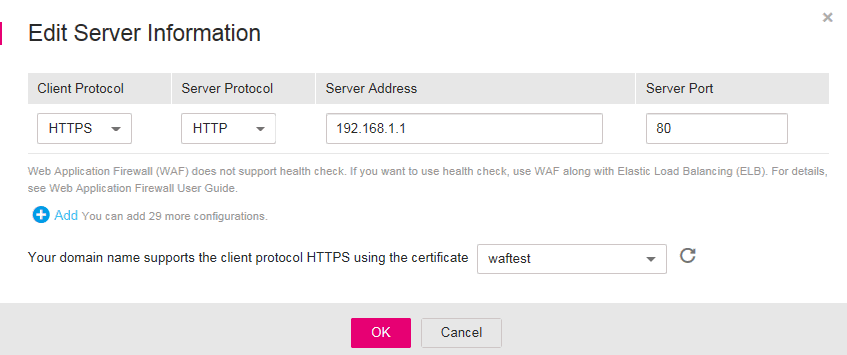

# How Do I Troubleshoot 500/502/504 Errors?

If an error such as 500 Internal Server Error, 502 Bad Gateway, or 504 Gateway Timeout occurs after your web server connects to WAF, use the following methods to locate the cause and remove the error:

## Symptom 1

After WAF is configured, your web server works properly. However, a few minutes later, a 502 Bad Gateway error is reported frequently.

-   Possible Causes

    Interception by a firewall, security protection software installed on the backend server, or the rate limiting policy

-   Solution

    Add the WAF IP address ranges to the whitelist of the firewall \(hardware or software\), security protection software, and rate limiting module.

## Symptom 2

After WAF is configured, the accessed page returns a 502/500 error frequently \(when multiple backend servers are configured\).

-   Possible Cause

    Origin server configuration error

-   Solution

    Locate the target domain name record in the domain name list and click the domain name. On the displayed page, click    in the  **Server Information**  area to check whether the protocol, IP address, and port number used by the origin server are correct. For details about editing domain information, see  [Viewing Basic Information](viewing-basic-information.md).

    **Figure  1**  Server configuration  
    

    As shown in  [Figure 1](#fig2409141215313), you can access the IP address of the origin server to check whether the backend service port is enabled.

## Symptom 3

After WAF is configured, a 502 Bad Gateway error is reported frequently when web visitors request access to your server over HTTPS. However, web visitors can directly access the server.

-   Possible Cause

    Outdated HTTPS version

-   Solution

    A lower SSL version has serious security risks. WAF supports TLSv1.2 or later. If your server has a lower SSL version, a 502 Bad Gateway error is reported after your server connects to WAF. In this case, you need to upgrade the SSL version of your server. You can visit  **https://www.ssllabs.com/ssltest/index.html**  to check your SSL version.

    -   If the OS of your web server is earlier than Windows Server 2008, the SSL protocol does not support TLSv1.2 or later. In this case, you need to upgrade the server OS to Windows Server 2008 or later \(or a new version of Linux\), and enable TLSv1.2 in services such as IIS.
    -   If your web server does not run Windows, check whether the SSL protocol is TLSv1.2 or later.

## Symptom 4

After WAF is configured, your web server works properly. However, when the number of requests increases, 502/504 errors increase as well. If web visitors directly access your web server, there is a possibility that the 502/504 error code is returned.

-   Possible Cause

    Backend server performance issue

-   Solution
    1.  Optimize the server configuration, including TCP network parameters and ulimit parameters.
    2.  Increase the number of backend ECSs to support rising service volumes. WAF supports configuration of multiple backend servers.
    3.  If web visitors request access to your web server over HTTPS, you can use HTTPS forwarding on the WAF side. However, it is recommended that HTTP be used to forward the requests to your web server, lowering the computational pressure on backend servers.

