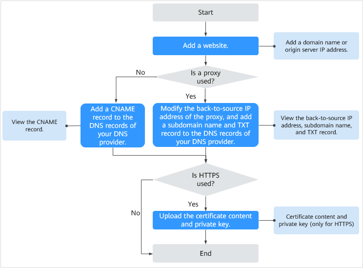

# Overview

Before using WAF, you need to  connect your domain name  to it and enable it for protection to take effect.

[Table 1](#table186068221358)  describes the procedure to use WAF.

**Table  1**  Procedure to use WAF

<table><thead align="left"><tr id="row760782211359"><th class="cellrowborder" valign="top" width="28.99%" id="mcps1.2.3.1.1">
Step

</th>
<th class="cellrowborder" valign="top" width="71.00999999999999%" id="mcps1.2.3.1.2">
Description

</th>
</tr>
</thead>
<tbody><tr id="row16607422173517"><td class="cellrowborder" valign="top" width="28.99%" headers="mcps1.2.3.1.1 ">
Creating a domain name

</td>
<td class="cellrowborder" valign="top" width="71.00999999999999%" headers="mcps1.2.3.1.2 ">
Add a website to be protected. For details, see <a href="creating-a-domain-name.md">Creating a Domain Name</a>.

</td>
</tr>
<tr id="row460742212359"><td class="cellrowborder" valign="top" width="28.99%" headers="mcps1.2.3.1.1 ">
Enabling WAF protection

</td>
<td class="cellrowborder" valign="top" width="71.00999999999999%" headers="mcps1.2.3.1.2 ">
Enable WAF protection to protect your web services. For details, see <a href="enabling-waf-protection.md">Enabling WAF Protection</a>.

 NOTE: 
<ul id="ul697716015340"><li>The WAF engine is not running on your web server. Therefore, your web server performance is not affected.</li><li>After the domain name is connected to WAF, there will be a latency of tens of milliseconds, but might be raised based on the size of the requested page or number of incoming requests.</li></ul>

</td>
</tr>
<tr id="row1960762215351"><td class="cellrowborder" valign="top" width="28.99%" headers="mcps1.2.3.1.1 ">
Configuring rules

</td>
<td class="cellrowborder" valign="top" width="71.00999999999999%" headers="mcps1.2.3.1.2 ">
In addition to the built-in protection rules, WAF provides a rich set of custom rules. For details, see <a href="rule-configurations.md">Rule Configurations</a>.

</td>
</tr>
<tr id="row16914191884019"><td class="cellrowborder" valign="top" width="28.99%" headers="mcps1.2.3.1.1 ">
Enabling alarm notification

</td>
<td class="cellrowborder" valign="top" width="71.00999999999999%" headers="mcps1.2.3.1.2 ">
Once the function is enabled, users can receive attack logs at the earliest moment. For details, see <a href="enabling-alarm-notification.md">Enabling Alarm Notification</a>.

</td>
</tr>
<tr id="row758655211510"><td class="cellrowborder" valign="top" width="28.99%" headers="mcps1.2.3.1.1 ">
Handling false alarms

</td>
<td class="cellrowborder" valign="top" width="71.00999999999999%" headers="mcps1.2.3.1.2 ">
If the attack events blocked or logged are false positives, mask them. For details, see <a href="handling-false-alarms.md">Handling False Alarms</a>.

</td>
</tr>
<tr id="row1999341519405"><td class="cellrowborder" valign="top" width="28.99%" headers="mcps1.2.3.1.1 ">
Viewing <strong id="b1101678347">Dashboard</strong>

</td>
<td class="cellrowborder" valign="top" width="71.00999999999999%" headers="mcps1.2.3.1.2 ">
View the request and attack statistics, event distribution, and top 5 attack resource IP addresses of yesterday, today, past 3 days, past 7 days, or past 30 days. For details, see <a href="dashboard.md">Dashboard</a>.

</td>
</tr>
</tbody>
</table>

For details about how to connect your domain name to WAF, see  [Figure 1](#en-us_topic_0119807183_fig1251423693315).

**Figure  1**  Flowchart for connecting your domain name to WAF  

