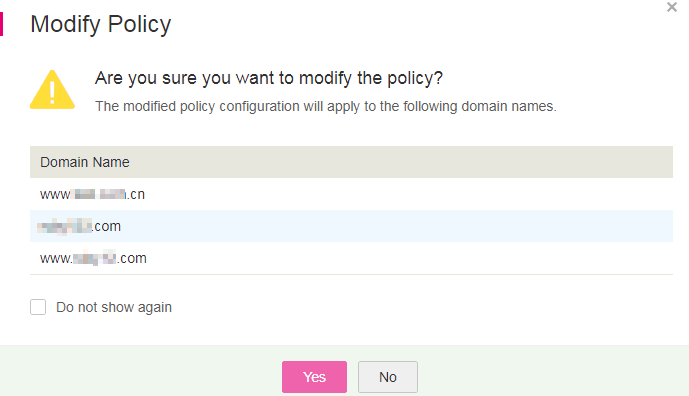

# Rule Configurations

This section describes how to configure protection rules.

> **NOTE:**   
>When you are modifying the configuration of a policy bound to two or more domain names, the  **Modify Policy**  dialog box is displayed, indicating that the modified policy configuration applies to multiple bound domain names. See  [Figure 1](#fig10336172412375). If you want to modify the policy configuration, click  **Yes**. To stop displaying this dialog box again, select  **Do not show again**.  
>**Figure  1** **Modify Policy**  dialog box    
>  

-   **[Enabling Basic Web Protection](enabling-basic-web-protection.md)**  

-   **[Configuring CC Attack Protection Rules](configuring-cc-attack-protection-rules.md)**  

-   **[Configuring Precise Protection Rules](configuring-precise-protection-rules.md)**  

-   **[Configuring Blacklist or Whitelist Rules](configuring-blacklist-or-whitelist-rules.md)**  

-   **[Configuring Web Tamper Protection Rules](configuring-web-tamper-protection-rules.md)**  

-   **[Configuring False Alarm Masking Rules](configuring-false-alarm-masking-rules.md)**  

-   **[Configuring Data Masking Rules](configuring-data-masking-rules.md)**  

